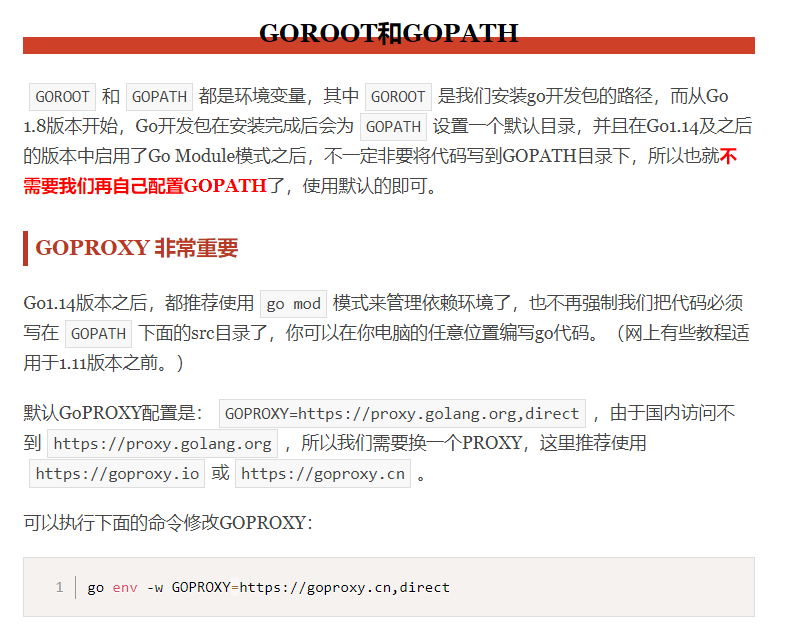
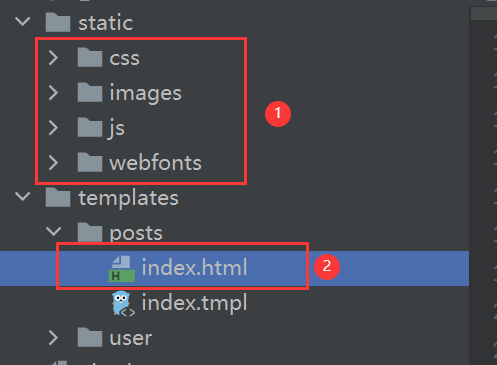
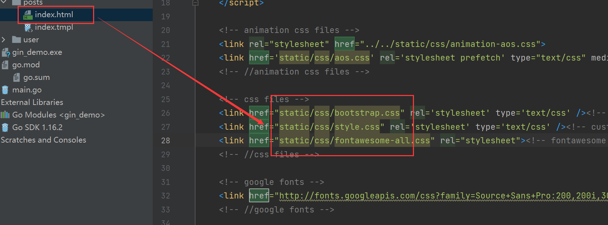
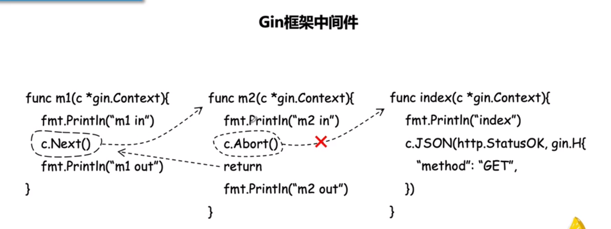

# Go使用问题

## GO安装与配置

https://www.liwenzhou.com/posts/Go/install_go_dev/





**可以执行下面的命令修改GOPROXY：**

```
go env -w GOPROXY=https://goproxy.cn,direct
```


### 1.代理设置

终端上输入

```go
go env -w GO111MODULE=on

go env -w GOPROXY=https://goproxy.cn,direct

```


### 2.使用go modlue一键下载依赖

```go
go get -d -v ./...

```


### 3.goland闪退

```
https://blog.csdn.net/qq_42004448/article/details/107727959?utm_medium=distribute.pc_relevant.none-task-blog-2%7Edefault%7EBlogCommendFromBaidu%7Edefault-6.baidujs&dist_request_id=1330144.22619.16181249093308117&depth_1-utm_source=distribute.pc_relevant.none-task-blog-2%7Edefault%7EBlogCommendFromBaidu%7Edefault-6.baidujs
```

重新安装goland的时候，最后一步点击 robot now


### 4. 运行正常，但是import爆红问题

删除go.mod,执行下面语句

```go
go mod init 项目名
go mod tidy
```


## GO语法 知识

### 编译与运行Go文件

```
cd 当前项目的文件夹下
go build
./项目名  (执行.exe文件)
```


### 指针类型与值类型

#### 指针类型的接收者

指针类型的接收者由一个结构体的指针组成，由于指针的特性，调用方法时修改接收者指针的任意成员变量，在方法结束后，修改都是有效的。这种方式就十分接近于其他语言中面向对象中的`this`或者`self`。 例如我们为`Person`添加一个`SetAge`方法，来修改实例变量的年龄。

```go
// SetAge 设置p的年龄
// 使用指针接收者
func (p *Person) SetAge(newAge int8) {
	p.age = newAge
}
```

调用该方法：

```go
func main() {
	p1 := NewPerson("小王子", 25)
	fmt.Println(p1.age) // 25
	p1.SetAge(30)
	fmt.Println(p1.age) // 30
}
```

#### 值类型的接收者

当方法作用于值类型接收者时，Go语言会在代码运行时将接收者的值复制一份。在值类型接收者的方法中可以获取接收者的成员值，但修改操作只是针对副本，无法修改接收者变量本身。

```go
// SetAge2 设置p的年龄
// 使用值接收者
func (p Person) SetAge2(newAge int8) {
	p.age = newAge
}

func main() {
	p1 := NewPerson("小王子", 25)
	p1.Dream()
	fmt.Println(p1.age) // 25
	p1.SetAge2(30) // (*p1).SetAge2(30)
	fmt.Println(p1.age) // 25
}
```


#### 什么时候应该使用指针类型接收者

1. 需要修改接收者中的值
2. 接收者是拷贝代价比较大的大对象
3. 保证一致性，如果有某个方法使用了指针接收者，那么其他的方法也应该使用指针接收者。


### Go语言的包（package）

#### 包介绍

`包（package）`是多个Go源码的集合，是一种高级的代码复用方案，Go语言为我们提供了很多内置包，如`fmt`、`os`、`io`等。

#### 定义包

我们还可以根据自己的需要创建自己的包。一个包可以简单理解为一个存放`.go`文件的文件夹。 该文件夹下面的所有go文件都要在代码的第一行添加如下代码，声明该文件归属的包。

```go
package 包名
```

注意事项：

- 一个文件夹下面直接包含的文件只能归属一个`package`，同样一个`package`的文件不能在多个文件夹下。
- 包名可以不和文件夹的名字一样，包名不能包含 `-` 符号。
- 包名为`main`的包为应用程序的入口包，这种包编译后会得到一个可执行文件，而编译不包含`main`包的源代码则不会得到可执行文件。

#### 可见性

如果想在一个包中引用另外一个包里的标识符（如变量、常量、类型、函数等）时，该标识符必须是对外可见的（public）。在Go语言中只需要将标识符的首字母大写就可以让标识符对外可见了。

举个例子， 我们定义一个包名为`pkg2`的包，代码如下：

```go
package pkg2

import "fmt"

// 包变量可见性

var a = 100 // 首字母小写，外部包不可见，只能在当前包内使用

// 首字母大写外部包可见，可在其他包中使用
const Mode = 1

type person struct { // 首字母小写，外部包不可见，只能在当前包内使用
	name string
}

// 首字母大写，外部包可见，可在其他包中使用
func Add(x, y int) int {
	return x + y
}

func age() { // 首字母小写，外部包不可见，只能在当前包内使用
	var Age = 18 // 函数局部变量，外部包不可见，只能在当前函数内使用
	fmt.Println(Age)
}
```

结构体中的字段名和接口中的方法名如果首字母都是大写，外部包可以访问这些字段和方法。例如：

```go
type Student struct {
	Name  string //可在包外访问的方法
	class string //仅限包内访问的字段
}

type Payer interface {
	init() //仅限包内访问的方法
	Pay()  //可在包外访问的方法
}
```

#### 包的导入

要在代码中引用其他包的内容，需要使用`import`关键字导入使用的包。具体语法如下:

```go
import "包的路径"
```

注意事项：

- import导入语句通常放在文件开头包声明语句的下面。
- 导入的包名需要使用双引号包裹起来。
- 包名是从`$GOPATH/src/`后开始计算的，使用`/`进行路径分隔。
- Go语言中禁止循环导入包。


### init()函数介绍

在Go语言程序执行时导入包语句会自动触发包内部`init()`函数的调用。需要注意的是：`init()`函数没有参数也没有返回值。 `init()`函数在程序运行时自动被调用执行，不能在代码中主动调用它。

包初始化执行的顺序如下图所示：

#### init()函数执行顺序

Go语言包会从`main`包开始检查其导入的所有包，每个包中又可能导入了其他的包。Go编译器由此构建出一个树状的包引用关系，再根据引用顺序决定编译顺序，依次编译这些包的代码。

在运行时，被最后导入的包会最先初始化并调用其`init()`函数， 如下图示：

### 接口

#### 接口类型

在Go语言中接口（interface）是一种类型，一种抽象的类型。

`interface`是一组`method`的集合，是`duck-type programming`的一种体现。接口做的事情就像是定义一个协议（规则），只要一台机器有洗衣服和甩干的功能，我就称它为洗衣机。不关心属性（数据），只关心行为（方法）。

为了保护你的Go语言职业生涯，请牢记接口（interface）是一种类型。


#### 接口的定义

Go语言提倡面向接口编程。

每个接口由数个方法组成，接口的定义格式如下：

```go
type 接口类型名 interface{
    方法名1( 参数列表1 ) 返回值列表1
    方法名2( 参数列表2 ) 返回值列表2
    …
}
```

其中：

- 接口名：使用`type`将接口定义为自定义的类型名。Go语言的接口在命名时，一般会在单词后面添加`er`，如有写操作的接口叫`Writer`，有字符串功能的接口叫`Stringer`等。接口名最好要能突出该接口的类型含义。
- 方法名：当方法名首字母是大写且这个接口类型名首字母也是大写时，这个方法可以被接口所在的包（package）之外的代码访问。
- 参数列表、返回值列表：参数列表和返回值列表中的参数变量名可以省略。

举个例子：

```go
type writer interface{
    Write([]byte) error
}
```

当你看到这个接口类型的值时，你不知道它是什么，唯一知道的就是可以通过它的Write方法来做一些事情。


#### 值接收者和指针接收者实现接口的区别

使用值接收者实现接口和使用指针接收者实现接口有什么区别呢？接下来我们通过一个例子看一下其中的区别。

我们有一个`Mover`接口和一个`dog`结构体。

```go
type Mover interface {
	move()
}

type dog struct {}
```

##### 值接收者实现接口

```go
func (d dog) move() {
	fmt.Println("狗会动")
}
```

此时实现接口的是`dog`类型：

```go
func main() {
	var x Mover
	var wangcai = dog{} // 旺财是dog类型
	x = wangcai         // x可以接收dog类型
	var fugui = &dog{}  // 富贵是*dog类型
	x = fugui           // x可以接收*dog类型
	x.move()
}
```

从上面的代码中我们可以发现，使用值接收者实现接口之后，不管是dog结构体还是结构体指针*dog类型的变量都可以赋值给该接口变量。因为Go语言中有对指针类型变量求值的语法糖，dog指针`fugui`内部会自动求值`*fugui`。

##### 指针接收者实现接口

同样的代码我们再来测试一下使用指针接收者有什么区别：

```go
func (d *dog) move() {
	fmt.Println("狗会动")
}
func main() {
	var x Mover
	var wangcai = dog{} // 旺财是dog类型
	x = wangcai         // x不可以接收dog类型
	var fugui = &dog{}  // 富贵是*dog类型
	x = fugui           // x可以接收*dog类型
}
```

> 此时实现`Mover`接口的是`*dog`类型，所以不能给`x`传入`dog`类型的wangcai，此时x只能存储`*dog`类型的值。


#### 空接口的定义

空接口是指没有定义任何方法的接口。因此任何类型都实现了空接口。

空接口类型的变量可以存储任意类型的变量。

```go
func main() {
	// 定义一个空接口x
	var x interface{}
	s := "Hello 沙河"
	x = s
	fmt.Printf("type:%T value:%v\n", x, x)
	i := 100
	x = i
	fmt.Printf("type:%T value:%v\n", x, x)
	b := true
	x = b
	fmt.Printf("type:%T value:%v\n", x, x)
}
```

#### 空接口的应用

##### 空接口作为函数的参数

使用空接口实现可以接收任意类型的函数参数。

```go
// 空接口作为函数参数
func show(a interface{}) {
	fmt.Printf("type:%T value:%v\n", a, a)
}
```

##### 空接口作为map的值

使用空接口实现可以保存任意值的字典。

```go
// 空接口作为map值
	var studentInfo = make(map[string]interface{})
	studentInfo["name"] = "沙河娜扎"
	studentInfo["age"] = 18
	studentInfo["married"] = false
	fmt.Println(studentInfo)
```


### channel

https://www.liwenzhou.com/posts/Go/14_concurrence/

单纯地将函数并发执行是没有意义的。函数与函数间需要交换数据才能体现并发执行函数的意义。

虽然可以使用共享内存进行数据交换，但是共享内存在不同的`goroutine`中容易发生竞态问题。为了保证数据交换的正确性，必须使用互斥量对内存进行加锁，这种做法势必造成性能问题。

Go语言的并发模型是`CSP（Communicating Sequential Processes）`，提倡**通过通信共享内存**而不是**通过共享内存而实现通信**。

如果说`goroutine`是Go程序并发的执行体，`channel`就是它们之间的连接。`channel`是可以让一个`goroutine`发送特定值到另一个`goroutine`的通信机制。

Go 语言中的通道（channel）是一种特殊的类型。通道像一个传送带或者队列，总是遵循先入先出（First In First Out）的规则，保证收发数据的顺序。每一个通道都是一个具体类型的导管，也就是声明channel的时候需要为其指定元素类型。

#### channel类型

`channel`是一种类型，一种引用类型。声明通道类型的格式如下：

```go
var 变量 chan 元素类型
```

举几个例子：

```go
var ch1 chan int   // 声明一个传递整型的通道
var ch2 chan bool  // 声明一个传递布尔型的通道
var ch3 chan []int // 声明一个传递int切片的通道
```

#### 创建channel

通道是引用类型，通道类型的空值是`nil`。

```go
var ch chan int
fmt.Println(ch) // <nil>
```

声明的通道后需要使用`make`函数初始化之后才能使用。

创建channel的格式如下：

```go
make(chan 元素类型, [缓冲大小])
```

channel的缓冲大小是可选的。

举几个例子：

```go
ch4 := make(chan int)
ch5 := make(chan bool)
ch6 := make(chan []int)
```

#### channel操作

通道有发送（send）、接收(receive）和关闭（close）三种操作。

发送和接收都使用`<-`符号。

现在我们先使用以下语句定义一个通道：

```go
ch := make(chan int)
```

##### 发送

将一个值发送到通道中。

```go
ch <- 10 // 把10发送到ch中
```

##### 接收

从一个通道中接收值。

```go
x := <- ch // 从ch中接收值并赋值给变量x
<-ch       // 从ch中接收值，忽略结果
```

##### 关闭

我们通过调用内置的`close`函数来关闭通道。

```go
close(ch)
```

关于关闭通道需要注意的事情是，只有在通知接收方goroutine所有的数据都发送完毕的时候才需要关闭通道。通道是可以被垃圾回收机制回收的，它和关闭文件是不一样的，在结束操作之后关闭文件是必须要做的，但关闭通道不是必须的。

关闭后的通道有以下特点：

1. 对一个关闭的通道再发送值就会导致panic。
2. 对一个关闭的通道进行接收会一直获取值直到通道为空。
3. 对一个关闭的并且没有值的通道执行接收操作会得到对应类型的零值。
4. 关闭一个已经关闭的通道会导致panic。


#### 无缓冲的通道

无缓冲的通道又称为阻塞的通道。我们来看一下下面的代码：

```go
func main() {
	ch := make(chan int)
	ch <- 10
	fmt.Println("发送成功")
}
```

上面这段代码能够通过编译，但是执行的时候会出现以下错误：

```bash
fatal error: all goroutines are asleep - deadlock!

goroutine 1 [chan send]:
main.main()
        .../src/github.com/Q1mi/studygo/day06/channel02/main.go:8 +0x54
```

为什么会出现`deadlock`错误呢？

因为我们使用`ch := make(chan int)`创建的是无缓冲的通道，无缓冲的通道只有在有人接收值的时候才能发送值。就像你住的小区没有快递柜和代收点，快递员给你打电话必须要把这个物品送到你的手中，简单来说就是无缓冲的通道必须有接收才能发送。

上面的代码会阻塞在`ch <- 10`这一行代码形成死锁，那如何解决这个问题呢？

一种方法是启用一个`goroutine`去接收值，例如：

```go
func recv(c chan int) {
	ret := <-c
	fmt.Println("接收成功", ret)
}
func main() {
	ch := make(chan int)
	go recv(ch) // 启用goroutine从通道接收值
	ch <- 10
	fmt.Println("发送成功")
}
```

无缓冲通道上的发送操作会阻塞，直到另一个`goroutine`在该通道上执行接收操作，这时值才能发送成功，两个`goroutine`将继续执行。相反，如果接收操作先执行，接收方的goroutine将阻塞，直到另一个`goroutine`在该通道上发送一个值。

使用无缓冲通道进行通信将导致发送和接收的`goroutine`同步化。因此，无缓冲通道也被称为`同步通道`。

#### 有缓冲的通道

解决上面问题的方法还有一种就是使用有缓冲区的通道。我们可以在使用make函数初始化通道的时候为其指定通道的容量，例如：

```go
func main() {
	ch := make(chan int, 1) // 创建一个容量为1的有缓冲区通道
	ch <- 10
	fmt.Println("发送成功")
}
```

只要通道的容量大于零，那么该通道就是有缓冲的通道，通道的容量表示通道中能存放元素的数量。就像你小区的快递柜只有那么个多格子，格子满了就装不下了，就阻塞了，等到别人取走一个快递员就能往里面放一个。

我们可以使用内置的`len`函数获取通道内元素的数量，使用`cap`函数获取通道的容量，虽然我们很少会这么做。

#### for range从通道循环取值

当向通道中发送完数据时，我们可以通过`close`函数来关闭通道。

当通道被关闭时，再往该通道发送值会引发`panic`，从该通道取值的操作会先取完通道中的值，再然后取到的值一直都是对应类型的零值。那如何判断一个通道是否被关闭了呢？

我们来看下面这个例子：

```go
// channel 练习
func main() {
	ch1 := make(chan int)
	ch2 := make(chan int)
	// 开启goroutine将0~100的数发送到ch1中
	go func() {
		for i := 0; i < 100; i++ {
			ch1 <- i
		}
		close(ch1)
	}()
	// 开启goroutine从ch1中接收值，并将该值的平方发送到ch2中
	go func() {
		for {
			i, ok := <-ch1 // 通道关闭后再取值ok=false
			if !ok {
				break
			}
			ch2 <- i * i
		}
		close(ch2)
	}()
	// 在主goroutine中从ch2中接收值打印
	for i := range ch2 { // 通道关闭后会退出for range循环
		fmt.Println(i)
	}
}
```

从上面的例子中我们看到有两种方式在接收值的时候判断该通道是否被关闭，不过我们通常使用的是`for range`的方式。使用`for range`遍历通道，当通道被关闭的时候就会退出`for range`。


### 网络编程

https://www.liwenzhou.com/posts/Go/15_socket/

#### TCP服务端

一个TCP服务端可以同时连接很多个客户端，例如世界各地的用户使用自己电脑上的浏览器访问淘宝网。因为Go语言中创建多个goroutine实现并发非常方便和高效，所以我们可以每建立一次链接就创建一个goroutine去处理。

TCP服务端程序的处理流程：

1. 监听端口
2. 接收客户端请求建立链接
3. 创建goroutine处理链接。

我们使用Go语言的net包实现的TCP服务端代码如下：

```go
// tcp/server/main.go

// TCP server端

// 处理函数
func process(conn net.Conn) {
	defer conn.Close() // 关闭连接
	for {
		reader := bufio.NewReader(conn)
		var buf [128]byte
		n, err := reader.Read(buf[:]) // 读取数据
		if err != nil {
			fmt.Println("read from client failed, err:", err)
			break
		}
		recvStr := string(buf[:n])
		fmt.Println("收到client端发来的数据：", recvStr)
		conn.Write([]byte(recvStr)) // 发送数据
	}
}

func main() {
	listen, err := net.Listen("tcp", "127.0.0.1:20000")
	if err != nil {
		fmt.Println("listen failed, err:", err)
		return
	}
	for {
		conn, err := listen.Accept() // 建立连接
		if err != nil {
			fmt.Println("accept failed, err:", err)
			continue
		}
		go process(conn) // 启动一个goroutine处理连接
	}
}
```

将上面的代码保存之后编译成`server`或`server.exe`可执行文件。

#### TCP客户端

一个TCP客户端进行TCP通信的流程如下：

1. 建立与服务端的链接
2. 进行数据收发
3. 关闭链接

使用Go语言的net包实现的TCP客户端代码如下：

```go
// tcp/client/main.go

// 客户端
func main() {
	conn, err := net.Dial("tcp", "127.0.0.1:20000")
	if err != nil {
		fmt.Println("err :", err)
		return
	}
	defer conn.Close() // 关闭连接
	inputReader := bufio.NewReader(os.Stdin)
	for {
		input, _ := inputReader.ReadString('\n') // 读取用户输入
		inputInfo := strings.Trim(input, "\r\n")
		if strings.ToUpper(inputInfo) == "Q" { // 如果输入q就退出
			return
		}
		_, err = conn.Write([]byte(inputInfo)) // 发送数据
		if err != nil {
			return
		}
		buf := [512]byte{}
		n, err := conn.Read(buf[:])
		if err != nil {
			fmt.Println("recv failed, err:", err)
			return
		}
		fmt.Println(string(buf[:n]))
	}
}
```

将上面的代码编译成`client`或`client.exe`可执行文件，先启动server端再启动client端，在client端输入任意内容回车之后就能够在server端看到client端发送的数据，从而实现TCP通信。


#### UDP

udp类似TCP  参考链接

https://www.liwenzhou.com/posts/Go/15_socket/


### 单元测试

https://www.liwenzhou.com/posts/Go/16_test/

##### go test工具

Go语言中的测试依赖`go test`命令。编写测试代码和编写普通的Go代码过程是类似的，并不需要学习新的语法、规则或工具。

go test命令是一个按照一定约定和组织的测试代码的驱动程序。在包目录内，所有以`_test.go`为后缀名的源代码文件都是`go test`测试的一部分，不会被`go build`编译到最终的可执行文件中。

在`*_test.go`文件中有三种类型的函数，单元测试函数、基准测试函数和示例函数。

|   类型   |         格式          |              作用              |
| :------: | :-------------------: | :----------------------------: |
| 测试函数 |   函数名前缀为Test    | 测试程序的一些逻辑行为是否正确 |
| 基准函数 | 函数名前缀为Benchmark |         测试函数的性能         |
| 示例函数 |  函数名前缀为Example  |       为文档提供示例文档       |

`go test`命令会遍历所有的`*_test.go`文件中符合上述命名规则的函数，然后生成一个临时的main包用于调用相应的测试函数，然后构建并运行、报告测试结果，最后清理测试中生成的临时文件。

##### 测试函数

###### 测试函数的格式

每个测试函数必须导入`testing`包，测试函数的基本格式（签名）如下：

```go
func TestName(t *testing.T){
    // ...
}
```

测试函数的名字必须以`Test`开头，可选的后缀名必须以大写字母开头，举几个例子：

```go
func TestAdd(t *testing.T){ ... }
func TestSum(t *testing.T){ ... }
func TestLog(t *testing.T){ ... }
```

其中参数`t`用于报告测试失败和附加的日志信息。 `testing.T`的拥有的方法如下：

```go
func (c *T) Error(args ...interface{})
func (c *T) Errorf(format string, args ...interface{})
func (c *T) Fail()
func (c *T) FailNow()
func (c *T) Failed() bool
func (c *T) Fatal(args ...interface{})
func (c *T) Fatalf(format string, args ...interface{})
func (c *T) Log(args ...interface{})
func (c *T) Logf(format string, args ...interface{})
func (c *T) Name() string
func (t *T) Parallel()
func (t *T) Run(name string, f func(t *T)) bool
func (c *T) Skip(args ...interface{})
func (c *T) SkipNow()
func (c *T) Skipf(format string, args ...interface{})
func (c *T) Skipped() bool
```


##### 测试覆盖率

测试覆盖率是你的代码被测试套件覆盖的百分比。通常我们使用的都是语句的覆盖率，也就是在测试中至少被运行一次的代码占总代码的比例。

Go提供内置功能来检查你的代码覆盖率。我们可以使用`go test -cover`来查看测试覆盖率。例如：

```bash
split $ go test -cover
PASS
coverage: 100.0% of statements
ok      github.com/Q1mi/studygo/code_demo/test_demo/split       0.005s
```

从上面的结果可以看到我们的测试用例覆盖了100%的代码。

Go还提供了一个额外的`-coverprofile`参数，用来将覆盖率相关的记录信息输出到一个文件。例如：

```bash
split $ go test -cover -coverprofile=c.out
PASS
coverage: 100.0% of statements
ok      github.com/Q1mi/studygo/code_demo/test_demo/split       0.005s
```


###### 打开生成的测试报告

上面的命令会将覆盖率相关的信息输出到当前文件夹下面的`c.out`文件中，然后我们执行`go tool cover -html=c.out`，使用`cover`工具来处理生成的记录信息，该命令会打开本地的浏览器窗口生成一个HTML报告。上图中每个用绿色标记的语句块表示被覆盖了，而红色的表示没有被覆盖。


#### 基准测试

#### 示例函数


### Context初识

Go1.7加入了一个新的标准库`context`，它定义了`Context`类型，专门用来简化 对于处理单个请求的多个 goroutine 之间与请求域的数据、取消信号、截止时间等相关操作，这些操作可能涉及多个 API 调用。

对服务器传入的请求应该创建上下文，而对服务器的传出调用应该接受上下文。它们之间的函数调用链必须传递上下文，或者可以使用`WithCancel`、`WithDeadline`、`WithTimeout`或`WithValue`创建的派生上下文。当一个上下文被取消时，它派生的所有上下文也被取消。

#### Context接口

`context.Context`是一个接口，该接口定义了四个需要实现的方法。具体签名如下：

```go
type Context interface {
    Deadline() (deadline time.Time, ok bool)
    Done() <-chan struct{}
    Err() error
    Value(key interface{}) interface{}
}
```

其中：

- `Deadline`方法需要返回当前`Context`被取消的时间，也就是完成工作的截止时间（deadline）；

- `Done`方法需要返回一个`Channel`，这个Channel会在当前工作完成或者上下文被取消之后关闭，多次调用`Done`方法会返回同一个Channel；

- ```
  Err
  ```

  方法会返回当前

  ```
  Context
  ```

  结束的原因，它只会在

  ```
  Done
  ```

  返回的Channel被关闭时才会返回非空的值；

  - 如果当前`Context`被取消就会返回`Canceled`错误；
  - 如果当前`Context`超时就会返回`DeadlineExceeded`错误；

- `Value`方法会从`Context`中返回键对应的值，对于同一个上下文来说，多次调用`Value` 并传入相同的`Key`会返回相同的结果，该方法仅用于传递跨API和进程间跟请求域的数据；

#### Background()和TODO()

Go内置两个函数：`Background()`和`TODO()`，这两个函数分别返回一个实现了`Context`接口的`background`和`todo`。我们代码中最开始都是以这两个内置的上下文对象作为最顶层的`partent context`，衍生出更多的子上下文对象。

`Background()`主要用于main函数、初始化以及测试代码中，作为Context这个树结构的最顶层的Context，也就是根Context。

`TODO()`，它目前还不知道具体的使用场景，如果我们不知道该使用什么Context的时候，可以使用这个。

`background`和`todo`本质上都是`emptyCtx`结构体类型，是一个不可取消，没有设置截止时间，没有携带任何值的Context。


> 通过context优雅的停止一个goroutine

```go
package main

import (
	"context"
	"fmt"
	"sync"

	"time"
)

var wg sync.WaitGroup

func worker(ctx context.Context) {
	go worker2(ctx)
LOOP:
	for {
		fmt.Println("worker")
		time.Sleep(time.Second)
		select {
		case <-ctx.Done(): // 等待上级通知
			break LOOP
		default:
		}
	}
	wg.Done()
}

func worker2(ctx context.Context) {
LOOP:
	for {
		fmt.Println("worker2")
		time.Sleep(time.Second)
		select {
		case <-ctx.Done(): // 等待上级通知
			break LOOP
		default:
		}
	}
}
func main() {
    //创建一个context
	ctx, cancel := context.WithCancel(context.Background())
	wg.Add(1)
	go worker(ctx)
	time.Sleep(time.Second * 3)
	cancel() // 通知子goroutine结束
	wg.Wait()
	fmt.Println("over")
}
```


#### 创建Context的方式

##### WithCancel

> `WithCancel`返回Context上下文与cancel函数，通过在主线程中调用cancel函数，会向ctx.Done()函数的channel中放入一个结束信号，通过在子线程中获取ctx.Done()函数的channel的信号来判断是否需要关闭子线程

`WithCancel`的函数签名如下：

```go
func WithCancel(parent Context) (ctx Context, cancel CancelFunc)
```


取消此上下文将释放与其关联的资源，因此代码应该在此上下文中运行的操作完成后立即调用cancel。

```go
func gen(ctx context.Context) <-chan int {
		dst := make(chan int)
		n := 1
		go func() {
			for {
				select {
                //判断ctx的chan中是否有结束信号
				case <-ctx.Done():
					return // return结束该goroutine，防止泄露
				case dst <- n:
					n++
				}
			}
		}()
		return dst
	}
func main() {
    //创建一个context
	ctx, cancel := context.WithCancel(context.Background())
	defer cancel() // 当我们取完需要的整数后调用cancel

	for n := range gen(ctx) {
		fmt.Println(n)
		if n == 5 {
			break
		}
	}
}
```

上面的示例代码中，`gen`函数在单独的goroutine中生成整数并将它们发送到返回的通道。 gen的调用者在使用生成的整数之后需要取消上下文，以免`gen`启动的内部goroutine发生泄漏。


##### WithDeadline

> ##### WithDeadline可以设定Context超时时间，当达到超时时间时，向ctx.Done()的channel中放入一个中止信号
>
> 尽管ctx会过期，但在任何情况下调用它的cancel函数都是很好的实践。

`WithDeadline`的函数签名如下：

```go
func WithDeadline(parent Context, deadline time.Time) (Context, CancelFunc)
```

返回父上下文的副本，并将deadline调整为不迟于d。如果父上下文的deadline已经早于d，则WithDeadline(parent, d)在语义上等同于父上下文。当截止日过期时，当调用返回的cancel函数时，或者当父上下文的Done通道关闭时，返回上下文的Done通道将被关闭，以最先发生的情况为准。

取消此上下文将释放与其关联的资源，因此代码应该在此上下文中运行的操作完成后立即调用cancel。

```go
func main() {
	d := time.Now().Add(50 * time.Millisecond)
	ctx, cancel := context.WithDeadline(context.Background(), d)

	// 尽管ctx会过期，但在任何情况下调用它的cancel函数都是很好的实践。
	// 如果不这样做，可能会使上下文及其父类存活的时间超过必要的时间。
	defer cancel()

	select {
	case <-time.After(1 * time.Second):
		fmt.Println("overslept")
	case <-ctx.Done():
		fmt.Println(ctx.Err())
	}
}
```

上面的代码中，定义了一个50毫秒之后过期的deadline，然后我们调用`context.WithDeadline(context.Background(), d)`得到一个上下文（ctx）和一个取消函数（cancel），然后使用一个select让主程序陷入等待：等待1秒后打印`overslept`退出或者等待ctx过期后退出。 因为ctx50秒后就过期，所以`ctx.Done()`会先接收到值，上面的代码会打印ctx.Err()取消原因。


##### WithTimeout

`WithTimeout`的函数签名如下：

```go
func WithTimeout(parent Context, timeout time.Duration) (Context, CancelFunc)
```

`WithTimeout`返回`WithDeadline(parent, time.Now().Add(timeout))`。

取消此上下文将释放与其相关的资源，因此代码应该在此上下文中运行的操作完成后立即调用cancel，通常用于数据库或者网络连接的超时控制。具体示例如下：

```go
package main

import (
	"context"
	"fmt"
	"sync"

	"time"
)

// context.WithTimeout

var wg sync.WaitGroup

func worker(ctx context.Context) {
    LOOP:
	for {
		fmt.Println("db connecting ...")
		time.Sleep(time.Millisecond * 10) // 假设正常连接数据库耗时10毫秒
		select {
		case <-ctx.Done(): // 50毫秒后自动调用
			break LOOP
		default:
		}
	}
	fmt.Println("worker done!")
	wg.Done()
}

func main() {
	// 设置一个50毫秒的超时
	ctx, cancel := context.WithTimeout(context.Background(), time.Millisecond*50)
	wg.Add(1)
	go worker(ctx)
	time.Sleep(time.Second * 5)
	cancel() // 通知子goroutine结束
	wg.Wait()
	fmt.Println("over")
}
```


##### WithValue

> WithValue实现利用context传递数据

`WithValue`函数能够将请求作用域的数据与 Context 对象建立关系。声明如下：

```go
func WithValue(parent Context, key, val interface{}) Context
```

`WithValue`返回父节点的副本，其中与key关联的值为val。

仅对API和进程间传递请求域的数据使用上下文值，而不是使用它来传递可选参数给函数。

所提供的键必须是可比较的，并且不应该是`string`类型或任何其他内置类型，以避免使用上下文在包之间发生冲突。`WithValue`的用户应该为键定义自己的类型。为了避免在分配给interface{}时进行分配，上下文键通常具有具体类型`struct{}`。或者，导出的上下文关键变量的静态类型应该是指针或接口。

```go
package main

import (
	"context"
	"fmt"
	"sync"

	"time"
)

// context.WithValue

type TraceCode string

var wg sync.WaitGroup

func worker(ctx context.Context) {
    // 在子goroutine中获取trace code
	key := TraceCode("TRACE_CODE")
	traceCode, ok := ctx.Value(key).(string) 
	if !ok {
		fmt.Println("invalid trace code")
	}
LOOP:
	for {
		fmt.Printf("worker, trace code:%s\n", traceCode)
		time.Sleep(time.Millisecond * 10) // 假设正常连接数据库耗时10毫秒
		select {
		case <-ctx.Done(): // 50毫秒后自动调用
			break LOOP
		default:
		}
	}
	fmt.Println("worker done!")
	wg.Done()
}

func main() {
	// 设置一个50毫秒的超时
	ctx, cancel := context.WithTimeout(context.Background(), time.Millisecond*50)
	// 在系统的入口中设置trace code传递给后续启动的goroutine实现日志数据聚合
	ctx = context.WithValue(ctx, TraceCode("TRACE_CODE"), "12512312234")
	wg.Add(1)
	go worker(ctx)
	time.Sleep(time.Second * 5)
	cancel() // 通知子goroutine结束
	wg.Wait()
	fmt.Println("over")
}
```


##### 创建方式总结：

* `context.WithCancel`:调用cancel看就会给`ctx.Done()`发信号
* `context.WithDeadline`：超时了也要调用`cancel()`
* `context.WithTimeOut`：超时了也要调用`cancel()`
* `context.WithValue`  ：注意key要使用自定义类型


#### 使用Context的注意事项

- 推荐以参数的方式显示传递Context
- 以Context作为参数的函数方法，应该把Context作为第一个参数。
- 给一个函数方法传递Context的时候，不要传递nil，如果不知道传递什么，就使用context.TODO()
- Context的Value相关方法应该传递请求域的必要数据，不应该用于传递可选参数
- Context是线程安全的，可以放心的在多个goroutine中传递


### 错误处理

#### error

**任何时候当你需要一个新的错误类型**，都可以用 errors（必须先 import）包的 errors.New 函数接收合适的错误信息来创建

像下面这样：

```go
err := errors.New("math - square root of negative number")
func Sqrt(f float64) (float64, error) {
if f < 0 {
        return 0, errors.New ("math - square root of negative number")
    }
}
```

**用 fmt 创建错误对象**：

通常你想要返回包含错误参数的更有信息量的字符串，例如：可以用 fmt.Errorf() 来实现：它和 fmt.Printf() 完全一样，接收有一个或多个格式占位符的格式化字符串和相应数量的占位变量。和打印信息不同的是它用信息生成错误对象。
比如在前面的平方根例子中使用：

```go
if f < 0 {
    return 0, fmt.Errorf("square root of negative number %g", f)
}
```


#### Panic

> 如发生Panic，先执行defer，再执行Panic，所有可以再defer中处理defer


#### Recover

> 从 panic 中恢复，recover 只能在 defer 修饰的函数中使用

正如名字一样，这个（recover）内建函数被用于从 panic 或 错误场景中恢复：让程序可以从 panicking 重新获得控制权，停止终止过程进而恢复正常执行。
**recover 只能在 defer 修饰的函数中使用**：用于取得 panic 调用中传递过来的错误值，如果是正常执行，调用 recover 会返回 nil，且没有其它效果。

总结：panic 会导致栈被展开直到 defer 修饰的 recover() 被调用或者程序中止。

```go
func protect(g func()) {
    defer func() {
        log.Println("done")
        // 即使有panic，Println也正常执行。
        if err := recover(); err != nil {
            log.Printf("run time panic: %v", err)
        }
    }()
    log.Println("start")
    g() //   可能发生运行时错误的地方
}
```


#### defer

> **必须要先声明defer，否则不能捕获到panic异常。recover() 的调用仅当它在 defer 函数中被直接调用时才有效**。

说到错误处理，就不得不提defer。先说说它的规则：

- **规则一** 当defer被声明时，其参数就会被实时解析             **（执行到defer语句时，defer中的参数会被赋值）**
- **规则二** defer执行顺序为先进后出
- **规则三** defer可以读取有名返回值，也就是可以改变有名返回参数的值。


**必须要先声明defer，否则不能捕获到panic异常。recover() 的调用仅当它在 defer 函数中被直接调用时才有效**。

panic 是用来表示非常严重的不可恢复的错误的。在Go语言中这是一个内置函数，接收一个interface{}类型的值（也就是任何值了）作为参数。

函数执行的时候panic了，函数不往下走，开始运行defer，defer处理完再返回。这时候（defer的时候），recover内置函数可以捕获到当前的panic（如果有的话），被捕获到的panic就不会向上传递了。
recover之后，逻辑并不会恢复到panic那个点去，函数还是会在defer之后返回。

大致过程：

Panic—->defer—>recover

```go
// 规则一，当defer被声明时，其参数就会被实时解析
package main
import "fmt"
func main() {
    var i int = 1
    defer fmt.Println("result =>", func() int { return i * 2 }())
    i++
    // 输出: result => 2 (而不是 4)
}
```

```go
// 规则二 defer执行顺序为先进后出
package main
import "fmt"
func main() {
    defer fmt.Print(" !!! ")
    defer fmt.Print(" world ")
    fmt.Print(" hello ")
}
//输出:  hello  world  !!!
```


## GO使用

### 切片

#### 初始化与赋值未知长度二维数组切片

```go
//初始化
res :=make([][]int,0)

//赋值
res = append(res, []int{1,2,3})
```


### 数组

#### 创建二维数组

```go
//创建二维数组
record := make([][]bool,sLen)
for i := 0; i < len(s); i++ {
    record[i] = make([]bool, sLen)
}
```


### map

#### map的创建、判断有无某元素

```go
//创建、判断map中有无某元素
m := make(map[int]int)
for index,value := range nums {
    //判断map中有无某元素
    index2,ok := m[target-value]
    if ok {
        return []int{index,index2}
    }
    m[value] = index
}
```


#### map中删除key、value

```go
delete(Map,key)
```


### 字符串

#### 截取字符串

#### 字符串后面添加元素

#### byte转字符串

#### string数组赋值

```go
//截取字符串  （左闭右开）
return s[start:start+len]

//字符串后面添加元素
str += "123"

//byte转字符串
str += string('b')

//string数组赋值
str := []string{"aa","aa"}
```


#### 指针传值

```go
func generateParenthesis(n int) []string {
	res :=[]string{}
    //传递指针类型
	recurrsion(n,n,"",&res)
	return res
}
//res *[]string 为指针
func recurrsion(leftNum,rightNum int, curStr string,res *[]string){
	if leftNum>rightNum ||leftNum<0||rightNum<0{
		return
	}
	if leftNum==0&&rightNum==0{
        //通过指针获取对象的值
		*res = append(*res,curStr)
		return
	}
	if leftNum>0{
		recurrsion(leftNum-1,rightNum,curStr+"(",res)
	}
	if rightNum >0{
		recurrsion(leftNum,rightNum-1,curStr+")",res)
	}
}
```


## Gin学习

**博客链接**

https://www.liwenzhou.com/posts/Go/Gin_framework/


#### 案例：使用gin返回前端模板

1.下载前端模板

```url
https://sc.chinaz.com/moban/190107489630.html 
```


2.将静态文件放入一个文件夹，并设置好静态文件访问映射




**main.go**

```go
package main

import (
	"github.com/gin-gonic/gin"
	"net/http"
)

func main() {
	r := gin.Default()
	//模板解析
	r.LoadHTMLGlob("templates/**/*")
	//静态路径映射 
    //html中访问/static 都映射到项目中main.go同一目录的static中
	r.Static("/static","./static")
	
	r.GET("home",func(c *gin.Context){
		//模板渲染  如果没有需要后端返回的参数，第三个参数填nil
		c.HTML(http.StatusOK, "index.html",nil)
	})

	r.Run(":8080")
}
```


Q：如果有静态文件没有找到

A：将静态文件的href改成 ”static开头“




**reslut**


#### 获取参数的各种方式

https://www.liwenzhou.com/posts/Go/Gin_framework/

##### 获取querystring参数

`querystring`指的是URL中`?`后面携带的参数，例如：`/user/search?username=小王子&address=沙河`。 获取请求的querystring参数的方法如下：

```go
func main() {
	//Default返回一个默认的路由引擎
	r := gin.Default()
	r.GET("/user/search", func(c *gin.Context) {
		username := c.DefaultQuery("username", "小王子")
		//username := c.Query("username")
		address := c.Query("address")
		//输出json结果给调用方
		c.JSON(http.StatusOK, gin.H{
			"message":  "ok",
			"username": username,
			"address":  address,
		})
	})
	r.Run()
}
```

##### 获取form参数

当前端请求的数据通过form表单提交时，例如向`/user/search`发送一个POST请求，获取请求数据的方式如下：

```go
func main() {
	//Default返回一个默认的路由引擎
	r := gin.Default()
	r.POST("/user/search", func(c *gin.Context) {
		// DefaultPostForm取不到值时会返回指定的默认值
		//username := c.DefaultPostForm("username", "小王子")
		username := c.PostForm("username")
		address := c.PostForm("address")
		//输出json结果给调用方
		c.JSON(http.StatusOK, gin.H{
			"message":  "ok",
			"username": username,
			"address":  address,
		})
	})
	r.Run(":8080")
}
```

##### 获取json参数

当前端请求的数据通过JSON提交时，例如向`/json`发送一个POST请求，则获取请求参数的方式如下：

```go
r.POST("/json", func(c *gin.Context) {
	// 注意：下面为了举例子方便，暂时忽略了错误处理
	b, _ := c.GetRawData()  // 从c.Request.Body读取请求数据
	// 定义map或结构体
	var m map[string]interface{}
	// 反序列化
	_ = json.Unmarshal(b, &m)

	c.JSON(http.StatusOK, m)
})
```

更便利的获取请求参数的方式，参见下面的 **参数绑定** 小节。

##### 获取path参数

请求的参数通过URL路径传递，例如：`/user/search/小王子/沙河`。 获取请求URL路径中的参数的方式如下。

```go
func main() {
	//Default返回一个默认的路由引擎
	r := gin.Default()
	r.GET("/user/search/:username/:address", func(c *gin.Context) {
		username := c.Param("username")
		address := c.Param("address")
		//输出json结果给调用方
		c.JSON(http.StatusOK, gin.H{
			"message":  "ok",
			"username": username,
			"address":  address,
		})
	})

	r.Run(":8080")
}
```


##### 参数绑定   

>   .ShouldBind()它能够基于请求自动提取`JSON`、`form表单`和`QueryString`类型的数据，并把值绑定到指定的结构体对象。

为了能够更方便的获取请求相关参数，提高开发效率，我们可以基于请求的`Content-Type`识别请求数据类型并利用反射机制自动提取请求中`QueryString`、`form表单`、`JSON`、`XML`等参数到结构体中。 

下面的示例代码演示了`.ShouldBind()`强大的功能，它能够基于请求自动提取`JSON`、`form表单`和`QueryString`类型的数据，并把值绑定到指定的结构体对象。

```go
// Binding from JSON
type Login struct {
	User     string `form:"user" json:"user" binding:"required"`
	Password string `form:"password" json:"password" binding:"required"`
}

func main() {
	router := gin.Default()

	// 绑定JSON的示例 ({"user": "q1mi", "password": "123456"})
	router.POST("/loginJSON", func(c *gin.Context) {
		var login Login

		if err := c.ShouldBind(&login); err == nil {
			fmt.Printf("login info:%#v\n", login)
			c.JSON(http.StatusOK, gin.H{
				"user":     login.User,
				"password": login.Password,
			})
		} else {
			c.JSON(http.StatusBadRequest, gin.H{"error": err.Error()})
		}
	})

	// 绑定form表单示例 (user=q1mi&password=123456)
	router.POST("/loginForm", func(c *gin.Context) {
		var login Login
		// ShouldBind()会根据请求的Content-Type自行选择绑定器
		if err := c.ShouldBind(&login); err == nil {
			c.JSON(http.StatusOK, gin.H{
				"user":     login.User,
				"password": login.Password,
			})
		} else {
			c.JSON(http.StatusBadRequest, gin.H{"error": err.Error()})
		}
	})

	// 绑定QueryString示例 (/loginQuery?user=q1mi&password=123456)
	router.GET("/loginForm", func(c *gin.Context) {
		var login Login
		// ShouldBind()会根据请求的Content-Type自行选择绑定器
		if err := c.ShouldBind(&login); err == nil {
			c.JSON(http.StatusOK, gin.H{
				"user":     login.User,
				"password": login.Password,
			})
		} else {
			c.JSON(http.StatusBadRequest, gin.H{"error": err.Error()})
		}
	})

	// Listen and serve on 0.0.0.0:8080
	router.Run(":8080")
}
```

`ShouldBind`会按照下面的顺序解析请求中的数据完成绑定：

1. 如果是 `GET` 请求，只使用 `Form` 绑定引擎（`query`）。
2. 如果是 `POST` 请求，首先检查 `content-type` 是否为 `JSON` 或 `XML`，然后再使用 `Form`（`form-data`）。


### Gin中间件

> Gin框架允许开发者在处理请求的过程中，加入用户自己的钩子（Hook）函数。这个钩子函数就叫中间件，中间件适合处理一些公共的业务逻辑，比如登录认证、权限校验、数据分页、记录日志、耗时统计等。
>
> （类似切片）

#### 定义中间件

```go
//执行到这一句时，先执行主体函数，结束后在执行中间件Next()后面的语句
c.Next()


// 不调用该请求的剩余处理程序  (中间件还是会执行完的)
c.Abort()
```





Gin中的中间件必须是一个`gin.HandlerFunc`类型。例如我们像下面的代码一样定义一个统计请求耗时的中间件。

```go
// StatCost 是一个统计耗时请求耗时的中间件
func StatCost() gin.HandlerFunc {
	return func(c *gin.Context) {
		start := time.Now()
		c.Set("name", "小王子") // 可以通过c.Set在请求上下文中设置值，后续的处理函数能够取到该值
		// 调用该请求的剩余处理程序 
		c.Next()
		// 不调用该请求的剩余处理程序
		// c.Abort()
		// 计算耗时
		cost := time.Since(start)
		log.Println(cost)
	}
}
```


#### 注册中间件    

> 使用中间件的方法  放在路由的参数里面
>
> r.GET("/test2", StatCost(), func(c *gin.Context)）

在gin框架中，我们可以为每个路由添加任意数量的中间件。

##### 为某个路由单独注册

```go
// 给/test2路由单独注册中间件（可注册多个）
	r.GET("/test2", StatCost(), func(c *gin.Context) {
		name := c.MustGet("name").(string) // 从上下文取值
		log.Println(name)
		c.JSON(http.StatusOK, gin.H{
			"message": "Hello world!",
		})
	})
```

##### 

##### 为全局路由注册

> r.Use(StatCost()) 全局执行路由函数之前，都会先执行中间件StatCost()

```go
func main() {
	// 新建一个没有任何默认中间件的路由
	r := gin.New()
	// 注册一个全局中间件
	r.Use(StatCost())
	
	r.GET("/test", func(c *gin.Context) {
		name := c.MustGet("name").(string) // 从上下文取值
		log.Println(name)
		c.JSON(http.StatusOK, gin.H{
			"message": "Hello world!",
		})
	})
	r.Run()
}
```

##### 为路由组注册中间件

为路由组注册中间件有以下两种写法。

写法1：

```go
shopGroup := r.Group("/shop", StatCost())
{
    shopGroup.GET("/index", func(c *gin.Context) {...})
    ...
}
```

写法2：

```go
shopGroup := r.Group("/shop")
shopGroup.Use(StatCost())
{
    shopGroup.GET("/index", func(c *gin.Context) {...})
    ...
}
```

#### 中间件注意事项

##### gin默认中间件

`gin.Default()`默认使用了`Logger`和`Recovery`中间件，其中：

- `Logger`中间件将日志写入`gin.DefaultWriter`，即使配置了`GIN_MODE=release`。
- `Recovery`中间件会recover任何`panic`。如果有panic的话，会写入500响应码。

如果不想使用上面两个默认的中间件，可以使用`gin.New()`新建一个没有任何默认中间件的路由。

##### gin中间件中使用goroutine

当在中间件或`handler`中启动新的`goroutine`时，**不能使用**原始的上下文（c *gin.Context），必须使用其只读副本（`c.Copy()`）。


## GORM

### 连接数据库

连接不同的数据库都需要导入对应数据的驱动程序，`GORM`已经贴心的为我们包装了一些驱动程序，只需要按如下方式导入需要的数据库驱动即可：

```go
import _ "github.com/jinzhu/gorm/dialects/mysql"
// import _ "github.com/jinzhu/gorm/dialects/postgres"
// import _ "github.com/jinzhu/gorm/dialects/sqlite"
// import _ "github.com/jinzhu/gorm/dialects/mssql"
```

### 连接MySQL

```go
import (
  "github.com/jinzhu/gorm"
  _ "github.com/jinzhu/gorm/dialects/mysql"
)

func main() {
  db, err := gorm.Open("mysql", "user:password@(localhost)/dbname?charset=utf8mb4&parseTime=True&loc=Local")
  defer db.Close()
}
```


### 创建数据库

在使用GORM前手动创建数据库`db1`：

```mysql
CREATE DATABASE db1;
```

### GORM操作MySQL

使用GORM连接上面的`db1`进行创建、查询、更新、删除操作。

```go
package main

import (
	"fmt"
	"github.com/jinzhu/gorm"
	_ "github.com/jinzhu/gorm/dialects/mysql"
)

// UserInfo 用户信息
type UserInfo struct {
	ID uint
	Name string
	Gender string
	Hobby string
}


func main() {
	db, err := gorm.Open("mysql", "root:root1234@(127.0.0.1:13306)/db1?charset=utf8mb4&parseTime=True&loc=Local")
	if err!= nil{
		panic(err)
	}
	defer db.Close()

	// 自动迁移
	db.AutoMigrate(&UserInfo{})

	u1 := UserInfo{1, "七米", "男", "篮球"}
	u2 := UserInfo{2, "沙河娜扎", "女", "足球"}
	// 创建记录
	db.Create(&u1)
	db.Create(&u2)
	// 查询
	var u = new(UserInfo)
	db.First(u)
	fmt.Printf("%#v\n", u)

	var uu UserInfo
	db.Find(&uu, "hobby=?", "足球")
	fmt.Printf("%#v\n", uu)

	// 更新
	db.Model(&u).Update("hobby", "双色球")
	// 删除
	db.Delete(&u)
}
```


## GRPC

> qimi—grpc博客：https://www.liwenzhou.com/posts/Go/gRPC/
>
> grpc-go的环境搭建及入门：https://www.jianshu.com/p/c644fe0f172f

### RPC是什么

在分布式计算，远程过程调用（英语：Remote Procedure Call，缩写为 RPC）是一个计算机通信协议。该协议允许运行于一台计算机的程序调用另一个地址空间（通常为一个开放网络的一台计算机）的子程序，而程序员就像调用本地程序一样，无需额外地为这个交互作用编程（无需关注细节）。RPC是一种服务器-客户端（Client/Server）模式，经典实现是一个通过`发送请求-接受回应`进行信息交互的系统。

### gRPC是什么

`gRPC`是一种现代化开源的高性能RPC框架，能够运行于任意环境之中。最初由谷歌进行开发。它使用HTTP/2作为传输协议。

在gRPC里，客户端可以像调用本地方法一样直接调用其他机器上的服务端应用程序的方法，帮助你更容易创建分布式应用程序和服务。与许多RPC系统一样，gRPC是基于定义一个服务，指定一个可以远程调用的带有参数和返回类型的的方法。在服务端程序中实现这个接口并且运行gRPC服务处理客户端调用。在客户端，有一个stub提供和服务端相同的方法。

### 为什么要用gRPC

使用gRPC， 我们可以一次性的在一个`.proto`文件中定义服务并使用任何支持它的语言去实现客户端和服务端，反过来，它们可以应用在各种场景中，从Google的服务器到你自己的平板电脑—— gRPC帮你解决了不同语言及环境间通信的复杂性。使用`protocol buffers`还能获得其他好处，包括高效的序列号，简单的IDL以及容易进行接口更新。总之一句话，使用gRPC能让我们更容易编写跨语言的分布式代码。


### GPRC使用

> 本地代码：E:\Code\Code\Go\GoProject\grpcDemo

gRPC开发分三步：

1. 编写`.proto`文件，生成指定语言源代码。
2. 编写服务端代码
3. 编写客户端代码

#### 编写proto代码

> grpc-go的环境搭建及入门：https://www.jianshu.com/p/c644fe0f172f
>
> 编译命令：在 helloworld路径下  protoc -I pb/ pb/helloworld.proto --go_out=plugins=grpc:.
>
> 注意添加这个option ：  `option go_package = "./pb";`

```protobuf
//编译命令：在 helloworld路径下  protoc -I pb/ pb/helloworld.proto --go_out=plugins=grpc:.

syntax = "proto3"; // 版本声明，使用Protocol Buffers v3版本

package pb; // 包名
option go_package = "./pb";

// 定义一个打招呼服务
service Greeter {
  // SayHello 方法
  rpc SayHello (HelloRequest) returns (HelloReply) {}
}

// 包含人名的一个请求消息
message HelloRequest {
  string name = 1;
}

// 包含问候语的响应消息
message HelloReply {
  string message = 1;
}
```

#### 编写服务端代码

```GO
package main

import (
	"fmt"
	"golang.org/x/net/context"
	"google.golang.org/grpc"
	"google.golang.org/grpc/reflection"
	"grpcDemo/helloworld/pb"
	"net"
)

type server struct{}

//定义在服务中的函数
func (s *server) SayHello(ctx context.Context, in *pb.HelloRequest) (*pb.HelloReply, error) {
   	//这里可以进行各种处理
    
    //返回处理结果给调用方
	return &pb.HelloReply{Message: "Hello " + in.Name}, nil
}

func main() {
	// 监听本地的8972端口
	lis, err := net.Listen("tcp", ":8972")
	if err != nil {
		fmt.Printf("failed to listen: %v", err)
		return
	}
	s := grpc.NewServer() // 创建gRPC服务器
	pb.RegisterGreeterServer(s, &server{}) // 在gRPC服务端注册服务

	reflection.Register(s) //在给定的gRPC服务器上注册服务器反射服务
	// Serve方法在lis上接受传入连接，为每个连接创建一个ServerTransport和server的goroutine。
	// 该goroutine读取gRPC请求，然后调用已注册的处理程序来响应它们。
	err = s.Serve(lis)
	if err != nil {
		fmt.Printf("failed to serve: %v", err)
		return
	}
}
```


#### 客户端代码

```GO
package main

import (
	"context"
	"fmt"
	"google.golang.org/grpc"
	"grpcDemo/helloworld/pb"
)

func main() {
	// 连接服务器
	conn, err := grpc.Dial(":8972", grpc.WithInsecure())
	if err != nil {
		fmt.Printf("faild to connect: %v", err)
	}
	defer conn.Close()

	c := pb.NewGreeterClient(conn)
	// 调用服务端的SayHello
	r, err := c.SayHello(context.Background(), &pb.HelloRequest{Name: "q1mi"})
	if err != nil {
		fmt.Printf("could not greet: %v", err)
	}
	fmt.Printf("Greeting: %s !\n", r.Message)
}
```

