# 日志收集系统开发记录

## 日志收集系统架构设计

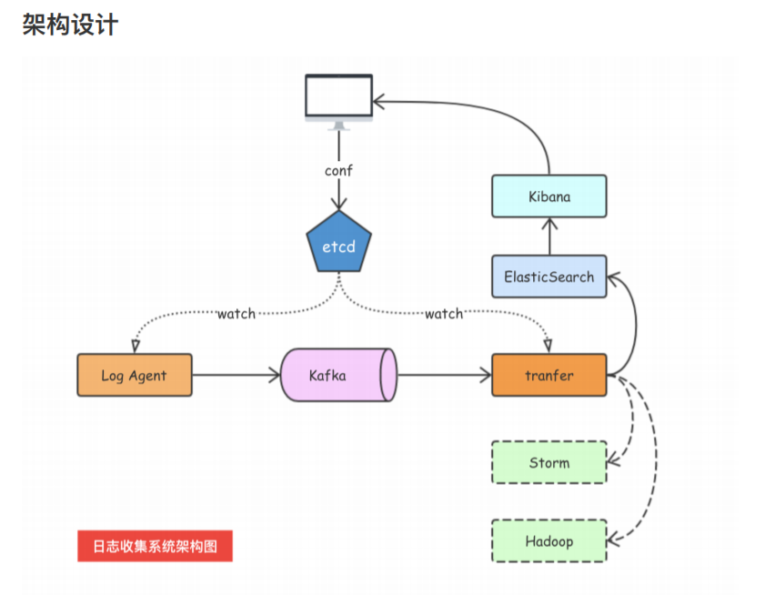

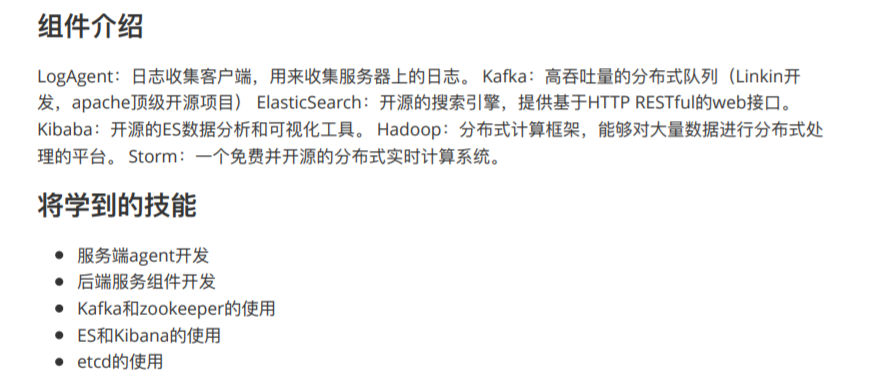


## kafka介绍

### kafka架构介绍

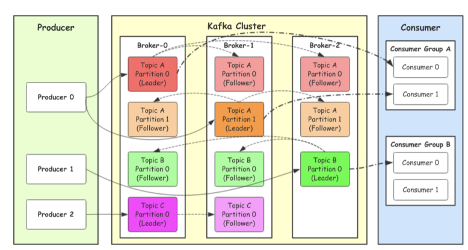

> kafka集群、Broker、Topic、Partition、Replication


### kafka工作流程

我们看上⾯的架构图中，producer就是⽣产者，是数据的⼊⼝。Producer在写⼊数据的时候会把数据 写⼊到leader中，不会直接将数据写⼊follower！那leader怎么找呢？写⼊的流程⼜是什么样的呢？我们看下图：


### 选择partition的原则

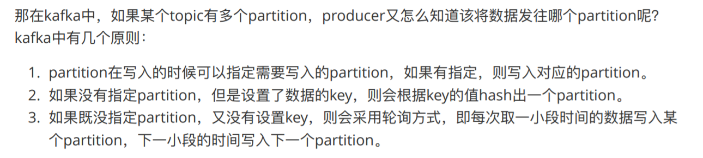


### ACK应答机制

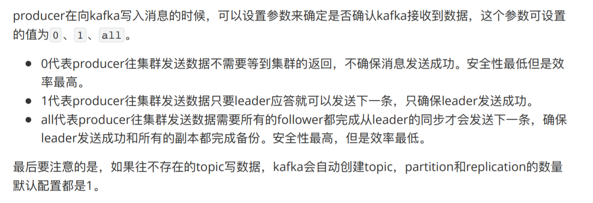


### Topic和数据日志

`topic` 是同⼀类别的消息记录（record）的集合。在Kafka中，⼀个主题通常有多个订阅者。对于每个主题，Kafka集群维护了⼀个分区数据⽇志⽂件结构如下：

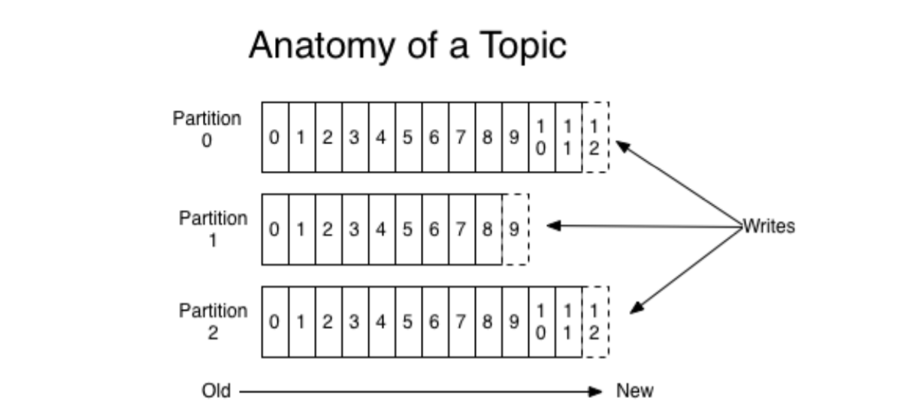

每个partition都是⼀个有序并且不可变的消息记录集合。当新的数据写⼊时，就被追加到partition的末 尾。在每个partition中，每条消息都会被分配⼀个顺序的唯⼀标识，这个标识被称为offset，即`偏移量`。注意，**Kafka只保证在同⼀个partition内部消息是有序的，在不同partition之间，并不能保证消息有序。**

 Kafka可以配置⼀个保留期限，⽤来标识⽇志会在Kafka集群内保留多⻓时间。Kafka集群会保留在保留 期限内所有被发布的消息，不管这些消息是否被消费过。⽐如保留期限设置为两天，那么数据被发布到 Kafka集群的两天以内，所有的这些数据都可以被消费。当超过两天，这些数据将会被清空，以便为后 续的数据腾出空间。由于Kafka会将数据进⾏持久化存储（即写⼊到硬盘上），所以保留的数据⼤⼩可 以设置为⼀个⽐较大的值。


### Partition结构

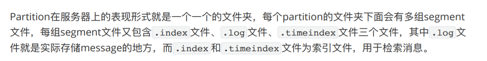


### 消费数据

多个消费者实例可以组成⼀个消费者组，并⽤⼀个标签来标识这个消费者组。⼀个消费者组中的不同消 费者实例可以运⾏在不同的进程甚⾄不同的服务器上。

 如果所有的消费者实例都在同⼀个消费者组中，那么消息记录会被很好的均衡的发送到每个消费者实例。

 如果所有的消费者实例都在不同的消费者组，那么每⼀条消息记录会被⼴播到每⼀个消费者实例。

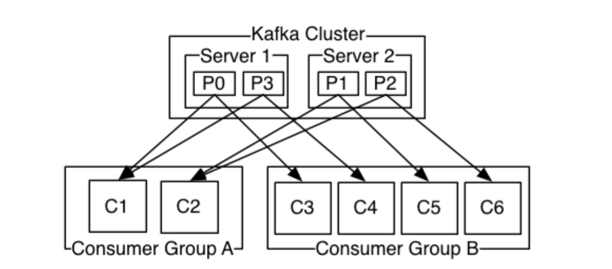

举个例⼦，如上图所示⼀个两个节点的Kafka集群上拥有⼀个四个partition（P0-P3）的topic。有两个消费者组都在消费这个topic中的数据，消费者组A有两个消费者实例，消费者组B有四个消费者实例。

 从图中我们可以看到，**在同⼀个消费者组中，每个消费者实例可以消费多个分区，但是每个分区最多只能被消费者组中的⼀个实例消费**。也就是说，如果有⼀个4个分区的主题，那么消费者组中最多只能有4 个消费者实例去消费，多出来的都不会被分配到分区。其实这也很好理解，如果允许两个消费者实例同 时消费同⼀个分区，那么就⽆法记录这个分区被这个消费者组消费的offset了。如果在消费者组中动态的上线或下线消费者，那么Kafka集群会⾃动调整分区与消费者实例间的对应关系。


### kafka使用场景

上面介绍了Kafka的⼀些基本概念和原理，那么Kafka可以做什么呢？⽬前主流使⽤场景基本如下：

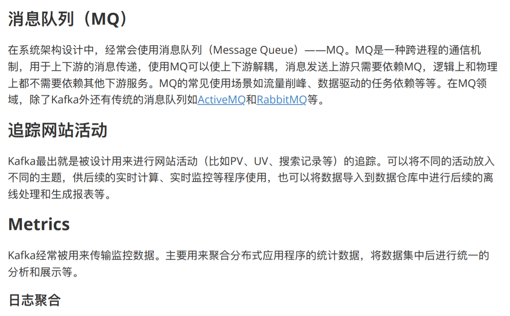

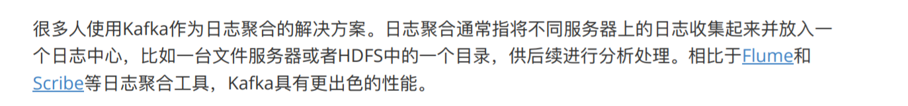


### kafka安装与运行

kafka本地安装目录：[E:\Kafka\kafka_2.8]()

```shell
//启动zookeeper
E:\Kafka\kafka_2.8\bin\windows>zookeeper-server-start.bat ..\..\config\zookeeper.properties

//启动kafka 需要先启动zookeeper
E:\Kafka\kafka_2.8\bin\windows>kafka-server-start.bat ..\..\config\server.properties
```


### 消费kafka中数据

> 使用kafka自带的kafka-console-consumer消费一下代码发生过去的消息

```
E:\Kafka\kafka_2.8\bin\windows>kafka-console-consumer.bat --bootstrap-server 127.0.0.1:9092 --topic shopping --from-beginning
```

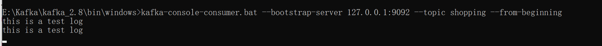


## ZooKeeper

### ZooKeeper介绍

> Zookeeper用于做服务的注册、发现

ZooKeeper是⼀个分布式的，开放源码的分布式应⽤程序协调服务，是Google的Chubby⼀个开源的实 现，它是集群的管理者，监视着集群中各个节点的状态根据节点提交的反馈进⾏下⼀步合理操作。最 终，将简单易⽤的接⼝和性能⾼效、功能稳定的系统提供给⽤户。


### Zookeeper安装、运行

参考链接:https://www.runoob.com/w3cnote/zookeeper-setup.html

本地ZooKeeper安装目录：[E:\Software\CodeSoftware\Zookeeper\apache-zookeeper-3.7.0-bin]()


## sarama使用

> sarama为kafka客户端，用sarama向kafka发送消息
>
> #### 先启动zookeeper与kafka
>
> #### 参考“kafka安装与运行”

### 下载安装

```
go get github.com/Shopify/sarama
```

### kafka发送文件示例

> 设一个Topic为shopping，向其中发生数据

```go
package main

import (
	"fmt"
	"github.com/Shopify/sarama"
)

func main() {
	//1.生产者配置
	config := sarama.NewConfig()
	config.Producer.RequiredAcks = sarama.WaitForAll          // 发送完数据需要leader和follow都确认
	config.Producer.Partitioner = sarama.NewRandomPartitioner // 新选出一个partition
	config.Producer.Return.Successes = true                   // 成功交付的消息将在success channel返回

	//2.连接kafka
	client, err := sarama.NewSyncProducer([]string{"127.0.0.1:9092"}, config)
	if err != nil {
		fmt.Println("producer closed, err:", err)
		return
	}
	defer client.Close()

	//3.封装消息
	msg :=&sarama.ProducerMessage{}
	msg.Topic = "shopping"
	msg.Value = sarama.StringEncoder("this is a test log")

	//4.发送消息
	pid, offset, err := client.SendMessage(msg)
	if err != nil {
		fmt.Println("send msg failed, err:", err)
		return
	}
	fmt.Printf("pid:%v offset:%v\n", pid, offset)

}
```


## tailf包

> tailf包用于读取文件内容

```go
package main

import (
	"fmt"
	"github.com/hpcloud/tail"
	"time"
)

//通过tail包，从文件中读取msg
func main() {
	fileName := `xx.log`
	//文件读取的权限
	config := tail.Config{
		ReOpen: true,
		Follow: true,
		Location: &tail.SeekInfo{Offset: 0, Whence: 2},
		MustExist: false,
		Poll: true,
	}

	//打开文件
	tails, err := tail.TailFile(fileName, config)
	if err != nil {
		fmt.Println("tail file failed, err:", err)
		return
	}
	var (
		msg *tail.Line
		ok bool
	)

	//读取文件的每一行
	for {
		msg, ok = <-tails.Lines
		if !ok {
			fmt.Printf("tail file close reopen, filename:%s\n",
				tails.Filename)
			//读取出错，等一秒在读
			time.Sleep(time.Second)
			continue
		}
		fmt.Println("msg:", msg.Text)
	}
}
```


## etcd介绍

### 介绍

etcd是使用Go语言开发的一个开源的、高可用的分布式key-value存储系统，**可以用于配置共享和服务的注册和发现**，类似项目有Zookeeper和consul

etcd具有以下特点

- 完全复制：集群中的每个节点都可以使用完整的存档
- 高可用性：Etcd可用于避免硬件的单点故障或网络问题（选择出另外的leader）
- 一致性：每次读取都会返回跨多主机的最新写入
- 简单：包括一个定义良好、面向用户的API（gRPC）
- 安全：实现了带有可选的客户端证书身份验证的自动化TLS
- 快速：每秒10000次写入的基准速度
- 可靠：使用 **Raft** 算法实现了强一致性，高可用的服务存储目录
  - Raft协议：选举、日志复制机制、异常处理（脑裂）、Zookeeper的zad协议的区别


### etcd应用场景

#### 服务发现

服务发现要解决的也是分布式系统中最常见的问题之一，即在同一个分布式集群中的进程或服务，要如何才能找到对方并建立连接。本质上来说，服务发现就是想要了解集群中是否有进程在监听udp或tcp端口，并且通过名字就可以查找和连接。


### 配置中心

将一些配置信息放到etcd上进行集中管理。这类场景的使用方式通常是这样的：应用启动的时候，主动从etcd获取一次配置信息，同时，在etcd节点上注册一个Watcher并等待，以后每次配置有更新的时候，etcd都会实时通知订阅者，以此达到获取最新配置信息的目的。

### 分布式锁

因为etcd使用Raft算法保持了数据的强一致性，某次操作存储到集群中的值必然是全局一致性的，所以很容易实现分布式锁。

锁服务有两种使用方式，一种是保持独占，二是控制时序。

- **保持独占即所有获取锁的用户最终只有一个可以得到**。etcd为此提供了一套实现分布式锁原子操作CAS（CompareAndSwap）的API。通过设置preExist值，可以保证在多个节点同时去创建某个目录时，只有一个成功，而创建成功的用户就可以认为是获得了锁。
- **控制时序，即所有想要获得锁的用户都会被安排执行，但是获得锁的顺序也是全局唯一的，同时决定了执行顺序。**etcd为此也提供了一套API（自动创建有序键），对一个目录建值时指定为POST动作，这样etcd会自动在目录下生成一个当前最大的键值。此时这些键的值就是客户端的时序，而这些键中的存储的值可以代表客户端的编号。


上图就是三个同时来竞争锁，最后只有一个获取到了锁


### etcd架构


从etcd的架构图中我们可以看到，etcd主要分为四个部分

- **HTTP Server**：用于处理用户发送的API请求以及其他etcd节点的同步与心跳信息请求
- **Store**：用于处理etcd支持的各类功能的事务，包括数据索引、节点状态变更、监控与反馈、事件处理与执行等等，是etcd对用户提供的大多数API功能的具体实现
- **Raft**：Raft强一致性算法的具体实现，是etcd的核心
- **WAL：Write Ahead Log（预写式日志）**，是etcd的数据存储方式。除了在内存中存有所有数据的状态以及节点的索引以外，etcd就通过WAL进行持久化存储。WAL中，所有的数据提交前都会实现记录日志。**Snapshot是为了防止数据过多而进行的状态快照；Entry表示存储的具体日志内容。**


#### etcd部署

> 部署文档：
>
> https://docs.qq.com/doc/DTndrQXdXYUxUU09O?opendocxfrom=admin


### etcd客户端使用

```powershell
E:\Software\CodeSoftware\Etcd\etcd-v3.5.0-windows-amd64>etcdctl.exe --endpoints=http://127.0.0.1:2379 put s4 "123"
```


### etcd在go中使用

#### 导包

> go.mod中导入包
>
> **导包问题解决：**
>
> https://www.cnblogs.com/zanyouxin/p/13537307.html
>
> https://zh.codeprj.com/blog/bac2b71.html

```go
replace github.com/coreos/bbolt v1.3.4 => go.etcd.io/bbolt v1.3.4

replace google.golang.org/grpc => google.golang.org/grpc v1.26.0

require (
	go.etcd.io/etcd v3.3.13+incompatible //indirect
)
```


#### 连接etcd进行put、get

> **LogCollectionProject/ectdDemo/main**
>
> 使用context是进行连接的超时控制

```go
package main

import (
	"context"
	"fmt"
	"go.etcd.io/etcd/clientv3"
	"time"
)

//
func main() {
	//1.连接etcd
	cli, err := clientv3.New(clientv3.Config {
		Endpoints: []string{"127.0.0.1:2379"}, // etcd的节点，可以传入多个
		DialTimeout: 5*time.Second, // 连接超时时间
	})

	if err != nil {
		fmt.Printf("connect to etcd failed, err: %v \n", err)
		return
	}
	fmt.Println("connect to etcd success")

	// 延迟关闭
	defer cli.Close()

	// put操作  设置1秒超时
    //使用context是进行连接的超时控制
	ctx, cancel := context.WithTimeout(context.Background(), time.Second)
	_, err = cli.Put(ctx, "s4", "zhenbucuo")
	//cancel()
	if err != nil {
		fmt.Printf("put to etcd failed, err:%v \n", err)
		return
	}

	// get操作，设置1秒超时
    //使用context是进行连接的超时控制
	ctx, cancel = context.WithTimeout(context.Background(), time.Second)
	resp, err := cli.Get(ctx, "s4")
	cancel()
	if err != nil {
		fmt.Printf("get from etcd failed, err:%v \n", err)
		return
	}
	for _, msg:=range resp.Kvs{
		fmt.Printf("key:%s,value:%s",msg.Key,msg.Value)
	}

}

```


#### watch

> 使用watch可以监听etcd中某个key的变化，从而实现配置的热更新 （配置更新了，watch能监听到）

> **LogCollectionProject/etcdDemo/watchDemo/main.go**

```go
package main

import (
	"context"
	"fmt"
	"go.etcd.io/etcd/clientv3"
	"time"
)

//watch:监听etcd中某个key的变化
func main()  {
	cli, err := clientv3.New(clientv3.Config {
		Endpoints: []string{"127.0.0.1:2379"}, // etcd的节点，可以传入多个
		DialTimeout: 5*time.Second, // 连接超时时间
	})

	if err != nil {
		fmt.Printf("connect to etcd failed, err: %v \n", err)
		return
	}
	fmt.Println("connect to etcd success")
	defer cli.Close()

	// watch
	// 派一个哨兵，一直监视着 moxi 这个key的变化（新增，修改，删除），返回一个只读的chan
	watchChan := cli.Watch(context.Background(), "s4")

	// 从通道中尝试获取值（监视的信息）
	for wresp := range watchChan {
		for _, msg := range wresp.Events{
			fmt.Printf("Type:%v key:%s value:%s \n", msg.Type, msg.Kv.Key, msg.Kv.Value)
		}
	}
}
```


# 日志收集系统开发

### logagent开发

#### ini配置文件解析

> 使用ini包解析配置文件，将配置文件与结构体双向转化
>
> ini包官方文档：https://ini.unknwon.io/docs/intro/getting_started


**配置信息**

> LogCoectionProject/logagent/config下

```ini
#kafka的配置信息
[kafka]
address = 127.0.0.1:9092
topic = shopping

#需要收集的文件的配置信息
[collect]
#自己随便在路径下创建一个log文件
logfile_path = E:\Kafka\kafka_2.8\log\s4.log
```


**解析配置文件**

> LogCoectionProject/logagent/mian中

```go
//0.ini配置文件解析(初始化连接kafka、读取文件准备)
var configObj = new(Config)
cfg , err := ini.Load("./config/config.ini")
if err != nil {
    logrus.Error("load config failed,err:%v", err)
    return
}

//0.1 将配置文件设置成结构体
err = cfg.MapTo(configObj)
if err != nil {
    logrus.Error("cfg.MapTo failed,err:%v", err)
    return
}
//fmt.Println(configObj)
```


### 初始化kafka

> 使用sarama包连接kafka，获得一个kafka客户端，之后通过这个客户端向kafka服务器发送信息

> LogCoectionProject/logagent/kafka/kafka.go中

```go
package kafka

//kafka相关操作
import (
	"github.com/Shopify/sarama"
)

var(
	//kafka客户端对象
	Client sarama.SyncProducer
)

//初始化一个全局的kafka的客户端
func InitKafka(address []string) error{
	//1.生产者配置
	config := sarama.NewConfig()
	config.Producer.RequiredAcks = sarama.WaitForAll          // 发送完数据需要leader和follow都确认
	config.Producer.Partitioner = sarama.NewRandomPartitioner // 新选出一个partition
	config.Producer.Return.Successes = true                   // 成功交付的消息将在success channel返回
                                                                                                                                 
	//2.连接kafka
	Client, err := sarama.NewSyncProducer(address, config)
	if err != nil {
		return err
	}
	defer Client.Close()

	//起一个goroutine专门用于发送msg到kafka
	go SendMsgToKafka()
	return nil
}
```


### 初始化tail

> 使用tail读取指定目录下的log文件的内容，方便后续将读取的内容发送到kafka中

> LogCoectionProject/logagent/tailfile/tailfile.go中

```go
package tailfile

import (
	"github.com/hpcloud/tail"
)

var (
    //tial对象
	TailObj *tail.Tail 
)
func Init(fileName string)(err error){
	//文件读取的权限
	config := tail.Config{
		ReOpen: true,
		Follow: true,
		Location: &tail.SeekInfo{Offset: 0, Whence: 2},
		MustExist: false,
		Poll: true,
	}

	//打开文件
	TailObj, err = tail.TailFile(fileName, config)
	if err != nil {
		return err
	}
	return
}

```


### tialfile.go增加CollectLogMsg功能

> 通过tialObj读取日记文件，封装成kafka中msg类型，丢到kafka的channel中

> LogCoectionProject/logagent/tailfile/tailfile.go中

```go
//通过tialObj读取日记文件，封装成kafka中msg类型，丢到kafka的channel中
func CollectLogMsg(){
	var (
		lineMsg *tail.Line
		ok bool
	)
	//读取文件的每一行,封装成kafka中msg类型，丢到kafka的channel中
	for {
		lineMsg, ok = <-TailObj.Lines
		if !ok {
			logrus.Warn("tail file fial open file, filename:%s\n",
				TailObj.Filename)
			//读取出错，等一秒在读
			time.Sleep(time.Second)
			continue
		}
		//2.读取到的一行msg封装成kafka中msg类型，丢到kafka的channel中
		fmt.Println("readLog-lineMsg:"+lineMsg.Text)
		kafkaMsg := kafka.ToKafkaMsg("shopping", lineMsg.Text)
		kafka.MsgChan <- kafkaMsg
	}
}
```


### kafka增加SendMsgToKafka功能

> 从MsgChan中读取msg，发送给kafka

> LogCoectionProject/logagent/kafka/kafka.go中

```go
//从MsgChan中读取msg，发送给kafka
func SendMsgToKafka(){
	for {
		//从MsgChan中读取msg
		select {
		case msg := <-MsgChan:
			fmt.Println(msg)
			pid, offset, err := client.SendMessage(msg)
			if err != nil {
				logrus.Error("kafka:SendMsgToKafka failed, err:", err)
				return
			}
			logrus.Info("send msg to kafka success,pid:%v,offset:%v",pid,offset)
		}
	}
}
```

