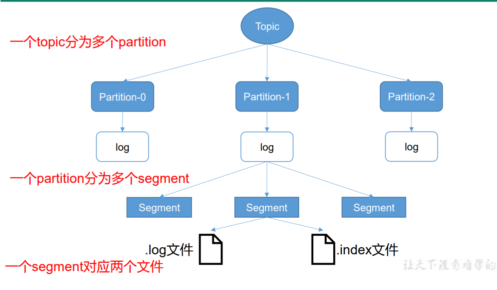
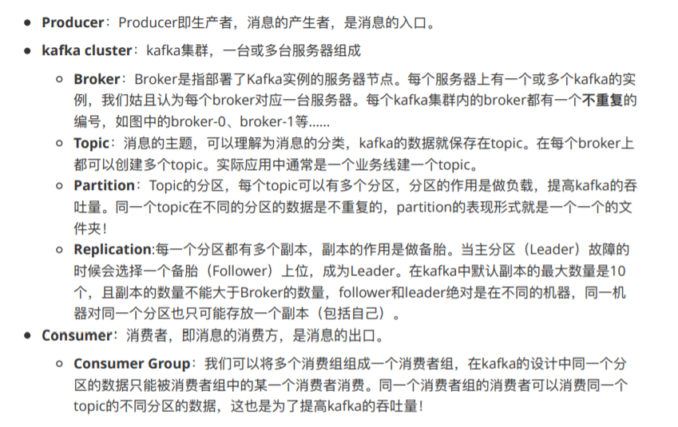
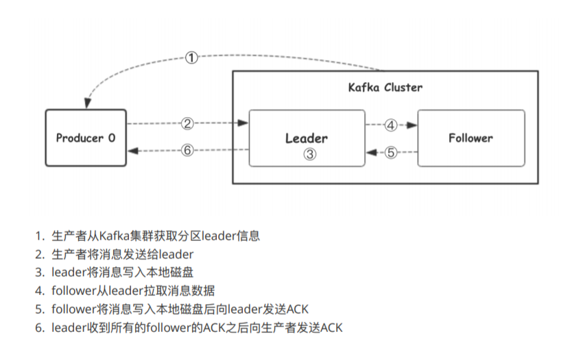
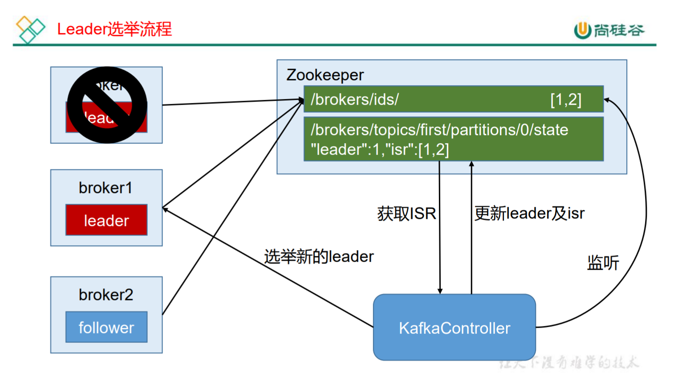
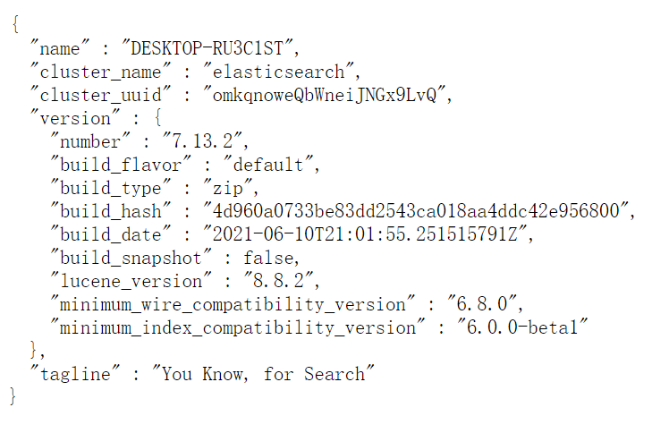
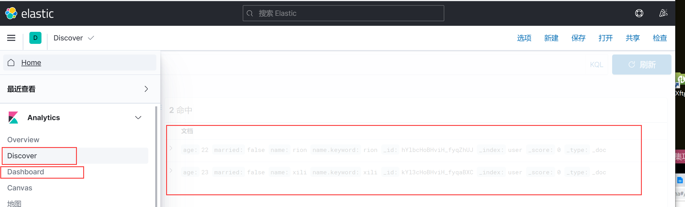
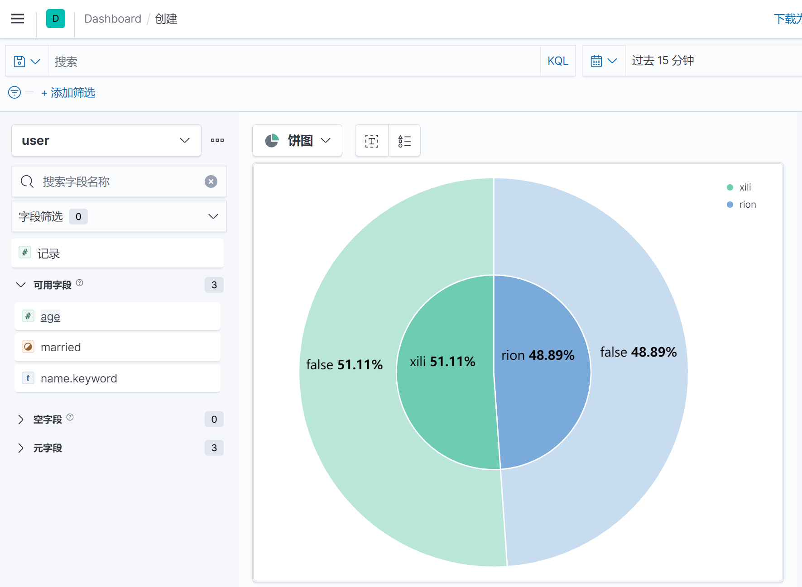
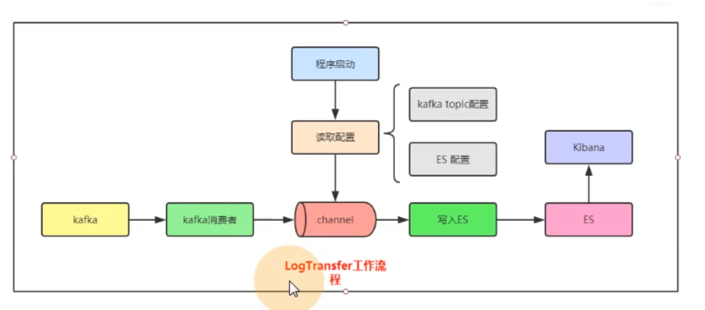

# 日志收集系统开发记录

## 日志收集系统架构设计


## kafka介绍

### kafka架构介绍


> .log文件存数据，.index文件存索引




> kafka集群、Broker、Topic、Partition（Leader）、Replication




### kafka工作流程

我们看上⾯的架构图中，producer就是⽣产者，是数据的⼊⼝。Producer在写⼊数据的时候会把数据 写⼊到leader中，不会直接将数据写⼊follower！那leader怎么找呢？写⼊的流程⼜是什么样的呢？我们看下图：




### 选择partition的原则


### ACK应答机制


### Topic和数据日志

`topic` 是同⼀类别的消息记录（record）的集合。在Kafka中，⼀个主题通常有多个订阅者。对于每个主题，Kafka集群维护了⼀个分区数据⽇志⽂件结构如下：


每个partition都是⼀个有序并且不可变的消息记录集合。当新的数据写⼊时，就被追加到partition的末 尾。在每个partition中，每条消息都会被分配⼀个顺序的唯⼀标识，这个标识被称为offset，即`偏移量`。注意，**Kafka只保证在同⼀个partition内部消息是有序的，在不同partition之间，并不能保证消息有序。**

 Kafka可以配置⼀个保留期限，⽤来标识⽇志会在Kafka集群内保留多⻓时间。Kafka集群会保留在保留 期限内所有被发布的消息，不管这些消息是否被消费过。⽐如保留期限设置为两天，那么数据被发布到 Kafka集群的两天以内，所有的这些数据都可以被消费。当超过两天，这些数据将会被清空，以便为后续的数据腾出空间。由于Kafka会将数据进⾏持久化存储（即写⼊到硬盘上），所以保留的数据⼤⼩可 以设置为⼀个⽐较大的值。


### Partition结构


### 消费数据

多个消费者实例可以组成⼀个消费者组，并⽤⼀个标签来标识这个消费者组。⼀个消费者组中的不同消 费者实例可以运⾏在不同的进程甚⾄不同的服务器上。

 如果所有的消费者实例都在同⼀个消费者组中，那么消息记录会被很好的均衡的发送到每个消费者实例。

 如果所有的消费者实例都在不同的消费者组，那么每⼀条消息记录会被⼴播到每⼀个消费者实例。


举个例⼦，如上图所示⼀个两个节点的Kafka集群上拥有⼀个四个partition（P0-P3）的topic。有两个消费者组都在消费这个topic中的数据，消费者组A有两个消费者实例，消费者组B有四个消费者实例。

 从图中我们可以看到，**在同⼀个消费者组中，每个消费者实例可以消费多个分区，但是每个分区最多只能被消费者组中的⼀个实例消费**。也就是说，如果有⼀个4个分区的主题，那么消费者组中最多只能有4 个消费者实例去消费，多出来的都不会被分配到分区。其实这也很好理解，如果允许两个消费者实例同 时消费同⼀个分区，那么就⽆法记录这个分区被这个消费者组消费的offset了。如果在消费者组中动态的上线或下线消费者，那么Kafka集群会⾃动调整分区与消费者实例间的对应关系。


### kafka使用场景

上面介绍了Kafka的⼀些基本概念和原理，那么Kafka可以做什么呢？⽬前主流使⽤场景基本如下：


### kafka安装与运行

kafka本地安装目录：[E:\Kafka\kafka_2.8]()

```shell
//启动zookeeper
E:\Kafka\kafka_2.8\bin\windows>zookeeper-server-start.bat ..\..\config\zookeeper.properties

//启动kafka 需要先启动zookeeper
E:\Kafka\kafka_2.8\bin\windows>kafka-server-start.bat ..\..\config\server.properties
```


### 消费kafka中数据

#### Go操作kafka

> 参考本文档中sarama的使用代码


#### 使用kafka客户端

> 使用kafka自带的kafka-console-consumer消费一下代码发生过去的消息

```
E:\Kafka\kafka_2.8\bin\windows>kafka-console-consumer.bat --bootstrap-server 127.0.0.1:9092 --topic shopping --from-beginning
```


### Zookeeper 在 Kafka 中的作用

Kafka 集群中有一个 broker 会被选举为 Controller，负责管理集群 broker 的上下线，所 有 topic 的分区副本分配和 leader 选举等工作。==Controller 的管理工作都是依赖于 Zookeeper 的。==

以下为 partition 的 leader 选举过程：




## ZooKeeper

### ZooKeeper介绍

> Zookeeper用于做服务的注册、发现

ZooKeeper是⼀个分布式的，开放源码的分布式应⽤程序协调服务，是Google的Chubby⼀个开源的实 现，它是集群的管理者，监视着集群中各个节点的状态根据节点提交的反馈进⾏下⼀步合理操作。最终，将简单易用的接口和性能⾼效、功能稳定的系统提供给用户。


### Zookeeper安装、运行

参考链接:https://www.runoob.com/w3cnote/zookeeper-setup.html

本地ZooKeeper安装目录：[E:\Software\CodeSoftware\Zookeeper\apache-zookeeper-3.7.0-bin]()


### Zookeeper在Kafka 中的作用

Kafka 集群中有一个 broker 会被选举为 Controller，负责管理集群 broker 的上下线，所 有 topic 的分区副本分配和 leader 选举等工作。==Controller 的管理工作都是依赖于 Zookeeper 的。==

以下为 partition 的 leader 选举过程：


## sarama使用

> sarama为kafka客户端，用sarama向kafka发送消息
>
> #### 先启动zookeeper与kafka
>
> #### 参考“kafka安装与运行”

### 下载安装

```
go get github.com/Shopify/sarama
```

### kafka发送数据示例

> 设一个Topic为shopping，向其中发送数据

```go
package main

import (
	"fmt"
	"github.com/Shopify/sarama"
)

func main() {
	//1.生产者配置
	config := sarama.NewConfig()
	config.Producer.RequiredAcks = sarama.WaitForAll          // 发送完数据需要leader和follow都确认
	config.Producer.Partitioner = sarama.NewRandomPartitioner // 新选出一个partition
	config.Producer.Return.Successes = true                   // 成功交付的消息将在success channel返回

	//2.连接kafka
	client, err := sarama.NewSyncProducer([]string{"127.0.0.1:9092"}, config)
	if err != nil {
		fmt.Println("producer closed, err:", err)
		return
	}
	defer client.Close()

	//3.封装消息
	msg :=&sarama.ProducerMessage{}
	msg.Topic = "shopping"
	msg.Value = sarama.StringEncoder("this is a test log")

	//4.发送消息
	pid, offset, err := client.SendMessage(msg)
	if err != nil {
		fmt.Println("send msg failed, err:", err)
		return
	}
	fmt.Printf("pid:%v offset:%v\n", pid, offset)

}
```


#### kafka消费数据示例

```go
package main

import (
	"fmt"

	"github.com/Shopify/sarama"
)

// kafka consumer

func main() {
	consumer, err := sarama.NewConsumer([]string{"127.0.0.1:9092"}, nil)
	if err != nil {
		fmt.Printf("fail to start consumer, err:%v\n", err)
		return
	}
	partitionList, err := consumer.Partitions("web_log") // 根据topic取到所有的分区
	if err != nil {
		fmt.Printf("fail to get list of partition:err%v\n", err)
		return
	}
	fmt.Println(partitionList)
	for partition := range partitionList { // 遍历所有的分区
		// 针对每个分区创建一个对应的分区消费者
		pc, err := consumer.ConsumePartition("web_log", int32(partition), sarama.OffsetNewest)
		if err != nil {
			fmt.Printf("failed to start consumer for partition %d,err:%v\n", partition, err)
			return
		}
		defer pc.AsyncClose()
		// 异步从每个分区消费信息
		go func(sarama.PartitionConsumer) {
			for msg := range pc.Messages() {
				fmt.Printf("Partition:%d Offset:%d Key:%v Value:%v", msg.Partition, msg.Offset, msg.Key, msg.Value)
			}
		}(pc)
	}
}
```


## tailf包

> tailf包用于读取文件内容

```go
package main

import (
	"fmt"
	"github.com/hpcloud/tail"
	"time"
)

//通过tail包，从文件中读取msg
func main() {
	fileName := `xx.log`
	//文件读取的权限
	config := tail.Config{
		ReOpen: true,
		Follow: true,
		Location: &tail.SeekInfo{Offset: 0, Whence: 2},
		MustExist: false,
		Poll: true,
	}

	//打开文件
	tails, err := tail.TailFile(fileName, config)
	if err != nil {
		fmt.Println("tail file failed, err:", err)
		return
	}
	var (
		msg *tail.Line
		ok bool
	)

	//读取文件的每一行
	for {
		msg, ok = <-tails.Lines
		if !ok {
			fmt.Printf("tail file close reopen, filename:%s\n",
				tails.Filename)
			//读取出错，等一秒在读
			time.Sleep(time.Second)
			continue
		}
		fmt.Println("msg:", msg.Text)
	}
}
```


## etcd介绍

### 介绍

etcd是使用Go语言开发的一个开源的、高可用的分布式key-value存储系统，==可以用于配置共享和服务的注册和发现==，类似项目有Zookeeper和consul

etcd具有以下特点

- 完全复制：集群中的每个节点都可以使用完整的存档
- 高可用性：Etcd可用于避免硬件的单点故障或网络问题（选择出另外的leader）
- 一致性：每次读取都会返回跨多主机的最新写入
- 简单：包括一个定义良好、面向用户的API（gRPC）
- 安全：实现了带有可选的客户端证书身份验证的自动化TLS
- 快速：每秒10000次写入的基准速度
- 可靠：使用 **Raft** 算法实现了强一致性，高可用的服务存储目录
  - Raft协议：选举、日志复制机制、异常处理（脑裂）、Zookeeper的zad协议的区别


### etcd应用场景

#### 服务发现

服务发现要解决的也是分布式系统中最常见的问题之一，即在同一个分布式集群中的进程或服务，要如何才能找到对方并建立连接。本质上来说，服务发现就是想要了解集群中是否有进程在监听udp或tcp端口，并且通过名字就可以查找和连接。


### 配置中心

将一些配置信息放到etcd上进行集中管理。这类场景的使用方式通常是这样的：应用启动的时候，主动从etcd获取一次配置信息，同时，在etcd节点上注册一个Watcher并等待，以后每次配置有更新的时候，etcd都会实时通知订阅者，以此达到获取最新配置信息的目的。

### 分布式锁

因为etcd使用Raft算法保持了数据的强一致性，某次操作存储到集群中的值必然是全局一致性的，所以很容易实现分布式锁。

锁服务有两种使用方式，一种是保持独占，二是控制时序。

- **保持独占即所有获取锁的用户最终只有一个可以得到**。etcd为此提供了一套实现分布式锁原子操作CAS（CompareAndSwap）的API。通过设置preExist值，可以保证在多个节点同时去创建某个目录时，只有一个成功，而创建成功的用户就可以认为是获得了锁。
- **控制时序，即所有想要获得锁的用户都会被安排执行，但是获得锁的顺序也是全局唯一的，同时决定了执行顺序。**etcd为此也提供了一套API（自动创建有序键），对一个目录建值时指定为POST动作，这样etcd会自动在目录下生成一个当前最大的键值。此时这些键的值就是客户端的时序，而这些键中的存储的值可以代表客户端的编号。


上图就是三个同时来竞争锁，最后只有一个获取到了锁


### etcd架构


从etcd的架构图中我们可以看到，etcd主要分为四个部分

- **HTTP Server**：用于处理用户发送的API请求以及其他etcd节点的同步与心跳信息请求
- **Store**：用于处理etcd支持的各类功能的事务，包括数据索引、节点状态变更、监控与反馈、事件处理与执行等等，是etcd对用户提供的大多数API功能的具体实现
- **Raft**：Raft强一致性算法的具体实现，是etcd的核心
- **WAL：Write Ahead Log（预写式日志）**，是etcd的数据存储方式。除了在内存中存有所有数据的状态以及节点的索引以外，etcd就通过WAL进行持久化存储。WAL中，所有的数据提交前都会实现记录日志。**Snapshot是为了防止数据过多而进行的状态快照；Entry表示存储的具体日志内容。**


### etcd部署

> 部署文档：
>
> https://docs.qq.com/doc/DTndrQXdXYUxUU09O?opendocxfrom=admin


### etcd服务端

**运行:**

[E:\Software\CodeSoftware\Etcd\etcd-v3.5.0-windows-amd64\etcd.exe]()


### etcd客户端使用

```powershell
E:\Software\CodeSoftware\Etcd\etcd-v3.5.0-windows-amd64>etcdctl.exe --endpoints=http://127.0.0.1:2379 put s4 "123"
```


### etcd在go中使用

#### 导包

> go.mod中导入包
>
> **导包问题解决：**
>
> https://www.cnblogs.com/zanyouxin/p/13537307.html
>
> https://zh.codeprj.com/blog/bac2b71.html

```go
replace github.com/coreos/bbolt v1.3.4 => go.etcd.io/bbolt v1.3.4

replace google.golang.org/grpc => google.golang.org/grpc v1.26.0

require (
	go.etcd.io/etcd v3.3.13+incompatible //indirect
)
```


#### 连接etcd进行put、get

> **LogCollectionProject/ectdDemo/main**
>
> 使用context是进行连接的超时控制

```go
package main

import (
	"context"
	"fmt"
	"go.etcd.io/etcd/clientv3"
	"time"
)

//
func main() {
	//1.连接etcd
	cli, err := clientv3.New(clientv3.Config {
		Endpoints: []string{"127.0.0.1:2379"}, // etcd的节点，可以传入多个
		DialTimeout: 5*time.Second, // 连接超时时间
	})

	if err != nil {
		fmt.Printf("connect to etcd failed, err: %v \n", err)
		return
	}
	fmt.Println("connect to etcd success")

	// 延迟关闭
	defer cli.Close()

	// put操作  设置1秒超时
    //使用context是进行连接的超时控制
	ctx, cancel := context.WithTimeout(context.Background(), time.Second)
	_, err = cli.Put(ctx, "s4", "zhenbucuo")
	//cancel()
	if err != nil {
		fmt.Printf("put to etcd failed, err:%v \n", err)
		return
	}

	// get操作，设置1秒超时
    //使用context是进行连接的超时控制
	ctx, cancel = context.WithTimeout(context.Background(), time.Second)
	resp, err := cli.Get(ctx, "s4")
	cancel()
	if err != nil {
		fmt.Printf("get from etcd failed, err:%v \n", err)
		return
	}
	for _, msg:=range resp.Kvs{
		fmt.Printf("key:%s,value:%s",msg.Key,msg.Value)
	}

}

```


#### watch

> 使用watch可以监听etcd中某个key的变化，从而实现配置的热更新 （例子：配置更新了，watch能监听到）

> **LogCollectionProject/etcdDemo/watchDemo/main.go**

```go
package main

import (
	"context"
	"fmt"
	"go.etcd.io/etcd/clientv3"
	"time"
)

//watch:监听etcd中某个key的变化
func main()  {
	cli, err := clientv3.New(clientv3.Config {
		Endpoints: []string{"127.0.0.1:2379"}, // etcd的节点，可以传入多个
		DialTimeout: 5*time.Second, // 连接超时时间
	})

	if err != nil {
		fmt.Printf("connect to etcd failed, err: %v \n", err)
		return
	}
	fmt.Println("connect to etcd success")
	defer cli.Close()

	// watch
	// 派一个哨兵，一直监视着 moxi 这个key的变化（新增，修改，删除），返回一个只读的chan
	watchChan := cli.Watch(context.Background(), "s4")

	// 从通道中尝试获取值（监视的信息）
	for wresp := range watchChan {
		for _, msg := range wresp.Events{
			fmt.Printf("Type:%v key:%s value:%s \n", msg.Type, msg.Kv.Key, msg.Kv.Value)
		}
	}
}
```


## gopsutil包

> 博客地址：https://www.liwenzhou.com/posts/Go/go_gopsutil/

### 介绍

`psutil`是一个**跨平台进程和系统监控**的Python库，而`gopsutil`是其Go语言版本的实现。本文介绍了它的基本使用。

Go语言部署简单、性能好的特点非常适合做一些诸如采集系统信息和监控的服务，本文介绍的[gopsutil](https://github.com/shirou/gopsutil)库是知名Python库：[psutil](https://github.com/giampaolo/psutil)的一个Go语言版本的实现。

### 安装

```bash
go get github.com/shirou/gopsutil
```

### 使用

#### CPU

**采集CPU相关信息。**

```go
import "github.com/shirou/gopsutil/cpu"

// cpu info
func getCpuInfo() {
	cpuInfos, err := cpu.Info()
	if err != nil {
		fmt.Printf("get cpu info failed, err:%v", err)
	}
	for _, ci := range cpuInfos {
		fmt.Println(ci)
	}
	// CPU使用率
	for {
		percent, _ := cpu.Percent(time.Second, false)
		fmt.Printf("cpu percent:%v\n", percent)
	}
}
```

**获取CPU负载信息：**

```go
import "github.com/shirou/gopsutil/load"

func getCpuLoad() {
	info, _ := load.Avg()
	fmt.Printf("%v\n", info)
}
```

#### Memory

```go
import "github.com/shirou/gopsutil/mem"

// mem info
func getMemInfo() {
	memInfo, _ := mem.VirtualMemory()
	fmt.Printf("mem info:%v\n", memInfo)
}
```

#### Host

```go
import "github.com/shirou/gopsutil/host"

// host info
func getHostInfo() {
	hInfo, _ := host.Info()
	fmt.Printf("host info:%v uptime:%v boottime:%v\n", hInfo, hInfo.Uptime, hInfo.BootTime)
}
```

#### Disk

```go
import "github.com/shirou/gopsutil/disk"

// disk info
func getDiskInfo() {
	parts, err := disk.Partitions(true)
	if err != nil {
		fmt.Printf("get Partitions failed, err:%v\n", err)
		return
	}
	for _, part := range parts {
		fmt.Printf("part:%v\n", part.String())
		diskInfo, _ := disk.Usage(part.Mountpoint)
		fmt.Printf("disk info:used:%v free:%v\n", diskInfo.UsedPercent, diskInfo.Free)
	}

	ioStat, _ := disk.IOCounters()
	for k, v := range ioStat {
		fmt.Printf("%v:%v\n", k, v)
	}
}
```

#### net IO

```go
import "github.com/shirou/gopsutil/net"

func getNetInfo() {
	info, _ := net.IOCounters(true)
	for index, v := range info {
		fmt.Printf("%v:%v send:%v recv:%v\n", index, v, v.BytesSent, v.BytesRecv)
	}
}
```


## grafana

展示数据的工具,监控数据可视化

* 搜索引擎找官网


## Elasticsearch

### 介绍

Elasticsearch（ES）是一个基于Lucene构建的开源、分布式、RESTful接口的**全文搜索引擎**。Elasticsearch还是一个分布式文档数据库，其中每个字段均可被索引，而且每个字段的数据均可被搜索，ES能够横向扩展至数以百计的服务器存储以及处理PB级的数据。可以在极短的时间内存储、搜索和分析大量的数据。通常作为具有复杂搜索场景情况下的核心发动机。


### Elasticsearch基本概念

#### Near Realtime(NRT) 几乎实时

Elasticsearch是一个几乎实时的搜索平台。意思是，从索引一个文档到这个文档可被搜索只需要一点点的延迟，这个时间一般为毫秒级。

#### Cluster 集群

群集是一个或多个节点（服务器）的集合， 这些节点共同保存整个数据，并在所有节点上提供联合索引和搜索功能。一个集群由一个唯一集群ID确定，并指定一个集群名（默认为“elasticsearch”）。该集群名非常重要，因为节点可以通过这个集群名加入群集，一个节点只能是群集的一部分。

确保在不同的环境中不要使用相同的群集名称，否则可能会导致连接错误的群集节点。例如，你可以使用logging-dev、logging-stage、logging-prod分别为开发、阶段产品、生产集群做记录。

#### Node节点

节点是单个服务器实例，它是群集的一部分，可以存储数据，并参与群集的索引和搜索功能。就像一个集群，节点的名称默认为一个随机的通用唯一标识符（UUID），确定在启动时分配给该节点。如果不希望默认，可以定义任何节点名。这个名字对管理很重要，目的是要确定你的网络服务器对应于你的ElasticSearch群集节点。

我们可以通过群集名配置节点以连接特定的群集。默认情况下，每个节点设置加入名为“elasticSearch”的集群。这意味着如果你启动多个节点在网络上，假设他们能发现彼此都会自动形成和加入一个名为“elasticsearch”的集群。

在单个群集中，你可以拥有尽可能多的节点。此外，如果“elasticsearch”在同一个网络中，没有其他节点正在运行，从单个节点的默认情况下会形成一个新的单节点名为”elasticsearch”的集群。

#### Index索引

索引是具有相似特性的文档集合。例如，可以为客户数据提供索引，为产品目录建立另一个索引，以及为订单数据建立另一个索引。索引由名称（必须全部为小写）标识，该名称用于在对其中的文档执行索引、搜索、更新和删除操作时引用索引。在单个群集中，你可以定义尽可能多的索引。

#### Type类型

在索引中，可以定义一个或多个类型。类型是索引的逻辑类别/分区，其语义完全取决于你。一般来说，类型定义为具有公共字段集的文档。例如，假设你运行一个博客平台，并将所有数据存储在一个索引中。在这个索引中，你可以为用户数据定义一种类型，为博客数据定义另一种类型，以及为注释数据定义另一类型。

#### Document文档

文档是可以被索引的信息的基本单位。例如，你可以为单个客户提供一个文档，单个产品提供另一个文档，以及单个订单提供另一个文档。本文件的表示形式为JSON（JavaScript Object Notation）格式，这是一种非常普遍的互联网数据交换格式。

在索引/类型中，你可以存储尽可能多的文档。请注意，尽管文档物理驻留在索引中，文档实际上必须索引或分配到索引中的类型。

#### Shards & Replicas分片与副本

索引可以存储大量的数据，这些数据可能超过单个节点的硬件限制。例如，十亿个文件占用磁盘空间1TB的单指标可能不适合对单个节点的磁盘或可能太慢服务仅从单个节点的搜索请求。

为了解决这一问题，Elasticsearch提供细分你的指标分成多个块称为分片的能力。当你创建一个索引，你可以简单地定义你想要的分片数量。每个分片本身是一个全功能的、独立的“指数”，可以托管在集群中的任何节点。

**Shards分片的重要性主要体现在以下两个特征：**

1. 分片允许你水平拆分或缩放内容的大小
2. 分片允许你分配和并行操作的碎片（可能在多个节点上）从而提高性能/吞吐量 这个机制中的碎片是分布式的以及其文件汇总到搜索请求是完全由ElasticSearch管理，对用户来说是透明的。

在同一个集群网络或云环境上，故障是任何时候都会出现的，拥有一个故障转移机制以防分片和节点因为某些原因离线或消失是非常有用的，并且被强烈推荐。为此，Elasticsearch允许你创建一个或多个拷贝，你的索引分片进入所谓的副本或称作复制品的分片，简称Replicas。

**Replicas的重要性主要体现在以下两个特征：**

1. 副本为分片或节点失败提供了高可用性。为此，需要注意的是，一个副本的分片不会分配在同一个节点作为原始的或主分片，副本是从主分片那里复制过来的。
2. 副本允许用户扩展你的搜索量或吞吐量，因为搜索可以在所有副本上并行执行。

#### ES基本概念与关系型数据库的比较

|                     ES概念                     |    关系型数据库    |
| :--------------------------------------------: | :----------------: |
|           Index（索引）支持全文检索            | Database（数据库） |
|                  Type（类型）                  |    Table（表）     |
| Document（文档），不同文档可以有不同的字段集合 |   Row（数据行）    |
|                 Field（字段）                  |  Column（数据列）  |
|                Mapping（映射）                 |   Schema（模式）   |


### ES使用

#### 启动

**启动ES服务器**：E:\Software\CodeSoftware\Elasticsearch\elasticsearch-7.13.2\bin>elasticsearch.bat 

**浏览器访问**：http://127.0.0.1:9200/



#### ES API

> ES API博客：https://www.liwenzhou.com/posts/Go/go_elasticsearch/


#### Go操作ES

> Demo路径： E:\Code\Code\Go\GoProject\LogCollectionProject\ESDemo
>
> ES Go操作ES博客：https://www.liwenzhou.com/posts/Go/go_elasticsearch/


```go
package main

import (
	"context"
	"fmt"

	"github.com/olivere/elastic/v7"
)

// ESDemo:Go操作Elasticsearch客户端像ES中插入数据

type Person struct {
	Name    string `json:"name"`
	Age     int    `json:"age"`
	Married bool   `json:"married"`
}

func main() {
	//创建一个客户端
	client, err := elastic.NewClient(elastic.SetURL("http://127.0.0.1:9200"))
	if err != nil {
		// Handle error
		panic(err)
	}

	fmt.Println("connect to es success")
	p1 := Person{Name: "xili", Age: 23, Married: false}
	//插入数据
	put1, err := client.Index().
		Index("user").
		BodyJson(p1).  //Json化数据
		Do(context.Background()) //执行插入操作
	if err != nil {
		// Handle error
		panic(err)
	}
	fmt.Printf("Indexed user %s to index %s, type %s\n", put1.Id, put1.Index, put1.Type)
}

```


## kibana

### 介绍

Kibana 是一个免费且开放的用户界面，能够让您**对 Elasticsearch 数据进行可视化**，并让您在 Elastic Stack 中进行导航。您可以进行各种操作，从跟踪查询负载，到理解请求如何流经您的整个应用，都能轻松完成。


### 下载

==注意：kibana的版本需要与ES的版本相同==

**下载地址**：https://www.elastic.co/cn/downloads/kibana


### 启动

> 中文设置：   E:\Software\CodeSoftware\Kibana\kibana-7.13.2-windows-x86_64\config的kibana.yml最后一行

**启动服务器**：E:\Software\CodeSoftware\Kibana\kibana-7.13.2-windows-x86_64\bin>kibana.bat

**浏览器访问**：http://localhost:5601/


> 数据展示与仪表盘







# 日志收集系统开发

### logagent开发

#### logagent流程梳理

logagent流程:https://www.processon.com/view/link/5d3d05a4e4b0b3e4dcd547ec#map


#### ini配置文件解析

> 使用ini包解析配置文件，将配置文件与结构体双向转化
>
> ini包官方文档：https://ini.unknwon.io/docs/intro/getting_started


**配置信息**

> **LogCoectionProject/logagent/config下**

```ini
#kafka的配置信息
[kafka]
address = 127.0.0.1:9092
topic = shopping
chan_size = 10000
#需要收集的文件的配置信息
[collect]
#自己随便在路径下创建一个log文件
logfile_path = E:\Kafka\kafka_2.8\log\s5.log

#etcd的配置信息
[etcd]
address = 127.0.0.1:2379
collect_key = collect_log_conf
```


**解析配置文件**

> **LogCoectionProject/logagent/mian中**

```go
//0.ini配置文件解析(初始化连接kafka、读取文件准备)
var configObj = new(Config)
cfg , err := ini.Load("./config/config.ini")
if err != nil {
    logrus.Error("load config failed,err:%v", err)
    return
}

//0.1 将配置文件设置成结构体
err = cfg.MapTo(configObj)
if err != nil {
    logrus.Error("cfg.MapTo failed,err:%v", err)
    return
}
//fmt.Println(configObj)
```


#### struct数据结构

> 项目中用到的struct

> **LogCoectionProject/logagent/common/struct.go**

```go
package common

import "github.com/hpcloud/tail"

//整个项目的配置结构体
type Config struct {
	KafkaConfig      `ini:"kafka"`
	CollectionConfig `ini:"collect"`
	EtcdConfig       `ini:"etcd"`
}

type KafkaConfig struct {
	Address string `ini:"address"`
	Topic string `ini:"topic"`
	ChanSize int `ini:"chan_size"`
}

type CollectionConfig struct {
	LogFilepath string `ini:"logfile_path"`
}

type EtcdConfig struct {
	Address string `ini:"address"`
	CollectKey string `ini:"collect_key"`
}

//日志收集项的数据结构
type CollectEntry struct {
	Path string `json:"path"`//日志所在路径
	Topic string `json:"topic"`//日志的主题
}

```


#### main函数

```go
package main

import (
	"LogCollectionProject/logagent/common"
	"LogCollectionProject/logagent/etcd"
	"LogCollectionProject/logagent/kafka"
	"LogCollectionProject/logagent/tailfile"
	"fmt"
	"github.com/sirupsen/logrus" //日志打印包
	"gopkg.in/ini.v1"            //ini包用于映射配置文件成go中的结构体
)


//日志收集的客户端
//target:收集指定目录下的日志文件，发送到kafka中
func main() {
	//0.ini配置文件解析(初始化连接kafka、读取文件准备)
	var configObj = new(common.Config)
	cfg , err := ini.Load("./config/config.ini")
	if err != nil {
		logrus.Error("load config failed,err:%v", err)
		return
	}

	//0.1 将配置文件设置成结构体
	err = cfg.MapTo(configObj)
	if err != nil {
		logrus.Error("cfg.MapTo failed,err:%v", err)
		return
	}
	fmt.Printf("configObj:%s\n",configObj)

	//1. 初始化通过sarama连接kafka
	err = kafka.InitKafka([]string{configObj.KafkaConfig.Address},configObj.KafkaConfig.ChanSize)
	if err != nil {
		logrus.Error("kafka:InitKafka failed,err:%v", err)
		return
	}
	fmt.Println("inint kafka client success")

	//2.根据配置初始化etcd
	err = etcd.Init([]string{configObj.EtcdConfig.Address})
	if err != nil {
		logrus.Error("etcd:InitEtcd failed,err:%v", err)
		return
	}
	fmt.Println("inint etcd client success")

	//2.1从etcd中拉去需要收集的日志的配置项，方便tial去根据配置项读取日志内容
	allConfig:=etcd.GetCollectionConfig(configObj.EtcdConfig.CollectKey)
	fmt.Printf("allConfig:%s\n",allConfig)

	//3.根据配置中的日志路径初始化tail,并让tail到对应路径收集log文件内容
	err = tailfile.Init(allConfig)
	if err != nil {
		logrus.Error("tailfile:InitTailfile failed,err:%v", err)
		return
	}
	fmt.Println("inint tailfile client success")

	//4.把tial读取的日志内容通过sarama发送到kafka中
	//tailObj --> log --> kafkaClient -->kafka
	//tailfile.Init中完成了

	fmt.Println("run logagent success")
	for {

	}
}

```


#### kafka

##### 初始化kafka

> 使用sarama包连接kafka，获得一个kafka客户端，之后通过这个客户端向kafka服务器发送信息

> **LogCoectionProject/logagent/kafka/kafka.go中**

```go
package kafka

//kafka相关操作
import (
	"github.com/Shopify/sarama"
)

var(
	//kafka客户端对象
	Client sarama.SyncProducer
)

//初始化一个全局的kafka的客户端
func InitKafka(address []string) error{
	//1.生产者配置
	config := sarama.NewConfig()
	config.Producer.RequiredAcks = sarama.WaitForAll          // 发送完数据需要leader和follow都确认
	config.Producer.Partitioner = sarama.NewRandomPartitioner // 新选出一个partition
	config.Producer.Return.Successes = true                   // 成功交付的消息将在success channel返回
                                                                                                                                 
	//2.连接kafka
	Client, err := sarama.NewSyncProducer(address, config)
	if err != nil {
		return err
	}
	defer Client.Close()

	//起一个goroutine专门用于发送msg到kafka
	go SendMsgToKafka()
	return nil
}
```


##### kafka增加SendMsgToKafka功能

> 从MsgChan中读取msg，发送给kafka

> **LogCoectionProject/logagent/kafka/kafka.go中**

```go
//从MsgChan中读取msg，发送给kafka
func SendMsgToKafka(){
	for {
		//从MsgChan中读取msg
		select {
		case msg := <-MsgChan:
			fmt.Println(msg)
			pid, offset, err := client.SendMessage(msg)
			if err != nil {
				logrus.Error("kafka:SendMsgToKafka failed, err:", err)
				return
			}
			logrus.Info("send msg to kafka success,pid:%v,offset:%v",pid,offset)
		}
	}
}
```


#### tailfile

##### 初始化tail

> 使用tail读取指定目录下的log文件的内容，方便后续将读取的内容发送到kafka中

> **LogCoectionProject/logagent/tailfile/tailfile.go中**

```go
package tailfile

import (
	"LogCollectionProject/logagent/common"
	"LogCollectionProject/logagent/kafka"
	"context"
	"fmt"
	"github.com/hpcloud/tail"
	"github.com/sirupsen/logrus"
	"strings"
	"time"
)

//tailTask结构体: 每个tailTask对应一个tailObj，通过tailObj读取对应path下文件的内容
type tailTask struct {
	path string
	topic string
	tailObj *tail.Tail
	ctx context.Context
	cancel context.CancelFunc
}

var(
	Config  tail.Config
)


func Init(allConfig []common.CollectEntry)(err error){
	//allConfig中存有若干个日志的手机项
	//针对每一个日志收集项创建一个对象的tailObj

	//1.初始化一个tailTask的管理者
	tailTaskManager := InitTailTaskManager(allConfig)

	//2.设置tail读取文件的权限
	Config = tail.Config{
		ReOpen: true,
		Follow: true,
		Location: &tail.SeekInfo{Offset: 0, Whence: 2},
		MustExist: false,
		Poll: true,

	}

	//2.1针对每一个日志收集项创建一个对象的tailObj
	for _,colEntry:= range allConfig{
		//根据每个收集日志项，创建并启动一个tail
		Run(tailTaskManager,colEntry)
	}


	//3.TTaskManager不断监听新的配置 (从SendNewConf不断取新的config)
	go TTaskManager.watch()

	return
}

//创建并运行一个tail对象
func Run(tailTaskManager tailTaskManager,colEntry common.CollectEntry)(err error){
	//打开文件
	TailObj, err := tail.TailFile(colEntry.Path, Config)
	if err != nil {
		logrus.Errorf("tailfile.Init: create tailObj failed,path:%s\n",colEntry.Path)
		return err
	}
	ctx,cancel :=context.WithCancel(context.Background())
	ttask :=tailTask{
		path:colEntry.Path,
		topic: colEntry.Topic,
		tailObj: TailObj,
		ctx: ctx,
		cancel: cancel,
	}
	//创建一个ttask就交给tailTaskManager管理,方便后续管理
	tailTaskManager.tailTaskMap[ttask.path] = &ttask

	//创建任务成功，直接让tailObj去收集日记
	fmt.Printf("creat a tailObj,  path:%s\n",ttask.path)
	go ttask.CollectLogMsg()
	return
}
```


##### tialfile.go增加CollectLogMsg功能

> 通过tialObj读取日记文件，封装成kafka中msg类型，丢到kafka的channel中
>
> CollectLogMsg添加Context.Done()的通道的监听，便于关闭启动CollectLogMsg的协程

> **LogCoectionProject/logagent/tailfile/tailfile.go中**

```go
//通过tialObj读取日记文件，封装成kafka中msg类型，丢到kafka的channel中
func (ttask *tailTask)CollectLogMsg(){
	var (
		lineMsg *tail.Line
		ok bool
	)
	//读取文件的每一行,封装成kafka中msg类型，丢到kafka的channel中

	for {
		//通过context优雅的关闭gorutine
		select {
		case <-ttask.ctx.Done():
			fmt.Printf("关闭一个ttask.CollectLogMsg的gorutine , path：%s\n",ttask.path)
			return
		case lineMsg, ok = <-ttask.tailObj.Lines:
			if !ok {
				logrus.Warnf("tail file fial open file, filename:%s\n",
					ttask.tailObj.Filename)
				//读取出错，等一秒在读
				time.Sleep(time.Second)
				continue
			}
			if len(strings.Trim(lineMsg.Text,"\r"))==0{
				continue
			}
			//2.读取到的一行msg封装成kafka中msg类型，丢到kafka的channel中
			fmt.Printf("len = %v  ,readLog-lineMsg:%v\n",len(lineMsg.Text),lineMsg.Text)
			kafkaMsg := kafka.ToKafkaMsg("shopping", lineMsg.Text)
			kafka.MsgChan <- kafkaMsg
		}

	}
}


```


##### 增加tailManager对tail的管理

> tailManager监听collectEntryChan有无新的配置
>
> tailManager负责优雅的关闭tail.collectMsg的gorutine

> **LogCoectionProject/logagent/tailfile/tailfile_manager.go中**

```go
package tailfile

import (
	"LogCollectionProject/logagent/common"
	"fmt"
)

/**
 * @author xhli
 * @date 2021/6/24 15:03
 * @version 1.0
 * @description: tailtask管理者
 */
type tailTaskManager struct {
	tailTaskMap map[string]*tailTask            //管理全局tailTask的map
	collectEntryList []common.CollectEntry      //初始化时，初始配置
	collectEntryChan chan []common.CollectEntry //等待新配置的通道
}

var (
	//全局的tailtask管理对象
	TTaskManager tailTaskManager
)

func InitTailTaskManager(allConf []common.CollectEntry) tailTaskManager{
	TTaskManager = tailTaskManager{
		tailTaskMap: make(map[string]*tailTask,20),
		collectEntryList:allConf,
		collectEntryChan: make(chan []common.CollectEntry),
	}
	return TTaskManager
}

//TTaskManager不断监听新的配置 (从SendNewConf不断取新的config)
func(ttManager tailTaskManager) watch(){
	//for 死循环，监听ttManager.collectEntryChan中有无新的配置
	for {
		//1、取出新的配置数组
		newConfs :=<-ttManager.collectEntryChan
		fmt.Println("get newConfs from ttManager.collectEntryChan,newConfs:",newConfs)
		//2、判断是否是新的配置
		for _,newConf :=range newConfs {
			if ttManager.isConfExist(newConf) {
				//旧的配置
				continue
			}
			//新的配置
			//根据每个收集日志项，创建并启动一个tail
			Run(ttManager,newConf)
		}

		//将newConf中不存在，而tailTakMap中存在的收集项对应的tailObj关掉
		for key,ttask :=range ttManager.tailTaskMap {
			var found bool
			for _,conf :=range newConfs{
				if key == conf.Path {
					found=true
					break
				}
			}
			//需要关闭这个任务
			if found==false{
				//ttaskManager不再管理这个任务
				delete(ttManager.tailTaskMap,key)
				//关闭这个任务的gorutine （tailfile.collectMsg的gorutine）
				ttask.cancel()
			}
		}
	}
}

func(ttManager tailTaskManager) isConfExist(conf common.CollectEntry) bool{
	_,ok :=ttManager.tailTaskMap[conf.Path]
	return ok
}

```


#### etcd

##### 连接etcd

> 使用etcd，方便从etcd中获取多个日志文件的配置项，或者通过watch监听配置项的变化

> **LogCoectionProject/logagent/etcd/etcd.go中**

```go
package etcd

import (
	"LogCollectionProject/logagent/common"
	"context"
	"encoding/json"
	"fmt"
	"github.com/sirupsen/logrus"
	"go.etcd.io/etcd/clientv3"
	"time"
)

//etcd相关操作
var(
	//etcd的客户端对象
	Client *clientv3.Client
)

//初始化etcd连接
func Init(address []string)(err error){
	//1.连接etcd
	Client, err = clientv3.New(clientv3.Config {
		Endpoints: address, // etcd的节点，可以传入多个
		DialTimeout: 5*time.Second, // 连接超时时间
	})

	if err != nil {
		fmt.Printf("connect to etcd failed, err: %v \n", err)
		return err
	}
	fmt.Println("etcd:connect to etcd success")

	return
}
```


##### 拉取配置项函数

> 通过etcd拉取日志收集的配置项的函数
>
> 假定:在ectd中存有json格式的日志收集的配置项（路径）

> **LogCoectionProject/logagent/etcd/etcd.go中**

```go
/**
	通过etcd拉取日志收集的配置项的函数
	假定:在ectd中存有json格式的日志收集的配置项（路径）
 **/
func GetCollectionConfig(key string)(collectEntryList []common.CollectEntry){
	//get操作，设置1秒超时
	//使用context是为了设置连接的超时时间
	ctx, cancel := context.WithTimeout(context.Background(), time.Second)
	defer cancel()
	//拉取json格式的日志收集的配置项（路径）
	resp, err := Client.Get(ctx, key)
	if err != nil {
		fmt.Printf("get conf from etcd failed, err:%v \n", err)
		return
	}

	if len(resp.Kvs) == 0 {
		logrus.Warnf("get len=0 conf from etcd by key:%s",key)
		return
	}
	//解析json映射成collectEntry对象
	result :=resp.Kvs[0]
	fmt.Printf("result.Value:%s\n",result.Value)
	err = json.Unmarshal(result.Value,&collectEntryList)
	if err != nil {
		fmt.Printf("etcd.GetCollectionConfig:json.Unmarshal failed, err:%v \n", err)
		return
	}
	return collectEntryList
}
```


##### watch监听

> 程序启动之后，获取最新的配置之后，就通过watch监听etxd中`key="collect_log_conf"`配置的变化

> **LogCoectionProject/logagent/etcd/etcd.go中**

```go
//通过watch监听etxd中`key="collect_log_conf"`配置的变化
func WatchConfig(collectKey string){
	watchChan := Client.Watch(context.Background(),collectKey)

	// 从通道中尝试获取值（监视的信息）
	var newCollectEntryList []common.CollectEntry
	for wresp := range watchChan {
		for _, watchMsg := range wresp.Events{
			fmt.Printf("etcd.WatchConfig: etch config chang-->Type:%v key:%s value:%s \n", watchMsg.Type, watchMsg.Kv.Key, watchMsg.Kv.Value)
			//解析新的配置信息
			err := json.Unmarshal(watchMsg.Kv.Value,&newCollectEntryList)
			if err != nil {
				fmt.Printf("etcd.WatchConfig:json.Unmarshal failed, err:%v \n", err)
				continue
			}
			//告诉tailfile模块，需要收集的日志Config改变了
			tailfile.SendNewConf(newCollectEntryList)
			fmt.Printf("etcd.WatchConfig: newCollectEntryList:%s \n",newCollectEntryList)


		}
	}
}
```


### logtransfer开发

#### 架构图


